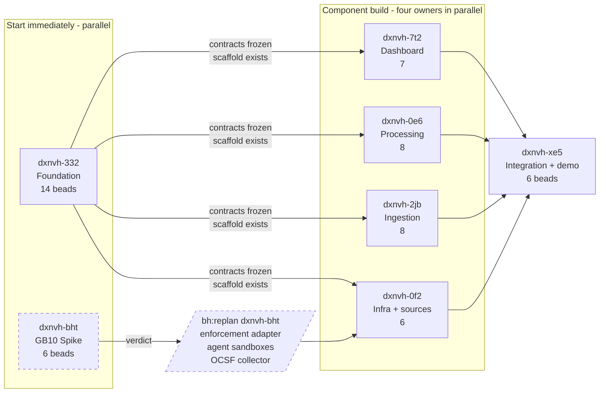

# Roadmap

Delivery plan for the Squid-centered local exfiltration protection system
described in [exfiltration-protection-architecture.md](./exfiltration-protection-architecture.md)
and [modular-implementation-plan.md](./modular-implementation-plan.md).

Work is tracked as seven beads molecules in the `dxnvh` hive. Per-molecule bead
diagrams live under [`epics/`](./epics/).

## The shape

Two tracks run in parallel from day one, because they need different things:
the scaffold needs four laptops, the spike needs the GB10.



## Sequencing

| Stage | Molecules | Gate to open it |
|---|---|---|
| 1 | `dxnvh-332` Foundation, `dxnvh-bht` Spike | Approve both now — independent of each other |
| 2 | `dxnvh-0f2` `dxnvh-2jb` `dxnvh-0e6` `dxnvh-7t2` | Contracts frozen (`dxnvh-332.2`) and scaffolds landed |
| 3 | Replan output from `dxnvh-bht.6` | Spike verdict recorded |
| 4 | `dxnvh-xe5` Integration | Components independently green against fixtures |

```bash
bh plan approve dxnvh-332 dxnvh-bht   # stage 1
bh plan status                        # kickoff state per molecule
```

Every molecule is filed at `kickoff=pending`. Nothing reaches `bd ready` until
its kickoff gate is resolved, so filing everything up front costs nothing.

## Why the spike exists

Every OpenShell and NemoClaw finding this team holds was established on
**x86_64, kernel 6.12.94, OpenShell 0.0.85, NemoClaw v0.0.93, a 1B model**.

The GB10 is **aarch64, kernel 6.17.0-1021-nvidia, OpenShell 0.0.91, NemoClaw not
installed, serving Qwen3.6-27B**.

The demo's climax — an analyst approves and OpenShell blocks the repeated
transfer — rests entirely on behaviour never observed on that architecture. The
three skills under `libs/skills/` carry explicit arch caveats telling the reader
to re-run their probes on the real host first.

So three bead groups are **deliberately not filed**: the OpenShell policy
enforcement adapter, the two-sandbox agent pair, and the OCSF collector.
`/bh:replan dxnvh-bht` files them once `dxnvh-bht.6` records the verdict.
On NO-GO for network-policy enforcement, the Squid denylist becomes the primary
enforcement point and `dxnvh-0f2` is replanned around it.

## Decisions already made

**Single uv workspace.** Root `pyproject.toml` with
`[tool.uv.workspace] members = ["libs/*", "services/*", "agents/*"]` and exactly
one `uv.lock`. This reverses the pattern documented at
`agents/hello-agent/pyproject.toml:12`. The cost was raised and accepted: one
lock is one merge surface across four laptops. uv ships no merge driver, so the
mitigation is a convention — never hand-merge, take either side and regenerate
(`dxnvh-332.5`).

**The polyglot seam is the justfile, not the workspace.** A uv workspace holds
Python only. `services/dashboard` is TypeScript/React on pnpm and is deliberately
not a member. Both toolchains answer the same root verbs, so adding a component
in a new language needs no root change.

**Enforcement can only be a network-policy update.** `filesystem_policy`,
`landlock` and `process` are locked at sandbox creation; only `network_policies`
hot-reload. So `deny_destination` compiles to a policy update on a running
sandbox — which is also the denial that emits a legible OCSF record. A filesystem
denial is a bare `EACCES` and would give the demo nothing to show.

**The agent reaches data through MCP.** Ingestion is FastMCP mounted into
FastAPI, exposing REST for infra and the dashboard, and MCP tools for the
security agent. The agent's sandbox then needs exactly one named egress endpoint
plus the built-in `inference.local` route — which makes "no inference left the
GB10" checkable rather than asserted. The `action_type` enum is enforced by the
tool schema, so a malformed recommendation fails at the protocol boundary.

**Deploy trigger is out of scope.** The team drives git pull and deploy
externally via git-workspace. This repo provides only the target that trigger
calls: a compose file, a build/up recipe, and a health check that exits non-zero
when the stack is not serving.

## Constraints carried from the skills

| Constraint | Source | Consequence |
|---|---|---|
| Fan-out ceiling ~4 concurrent subagents | `nemoclaw-fanout` | Security agent is a single investigator, not an orchestrator |
| `filesystem_policy` static, `network_policies` dynamic | `openshell-data-boundary` | Sandbox filesystem design is decided before first onboard |
| Shared writable mount leaks across sandboxes | `openshell-data-boundary` | Agent pair must not share a scratch mount |
| `openshell logs` is a bounded ring buffer | `openshell-egress-audit` | OCSF collector must tail, never poll scrollback |
| Endpoints are binary-scoped | `openshell-egress-audit` | Policy updates need `--binary` or stay denied |
| `inference.local` is proxied, not exempt | `spark-inference` | Reachable under default-deny, still audited |
| Unified memory is one pool | `infra/gb10/README.md` | vLLM and nightly training contend (`dxnvh-bht.2`) |

## Definition of success

> A locally running OpenClaw business agent performs normal work inside
> OpenShell. A suspicious cross-action sequence is detected locally, an always-on
> OpenClaw security agent investigates it using NemoClaw-routed local inference,
> an analyst approves the recommended policy, and OpenShell blocks the repeated
> transfer. No customer data, telemetry, or inference leaves the GB10.

`dxnvh-xe5.5` is the bead that decides this. It runs the eleven-step scenario
from section 9 as one scripted test, asserting outcomes rather than printing
output, with the final run performed with egress disabled.
