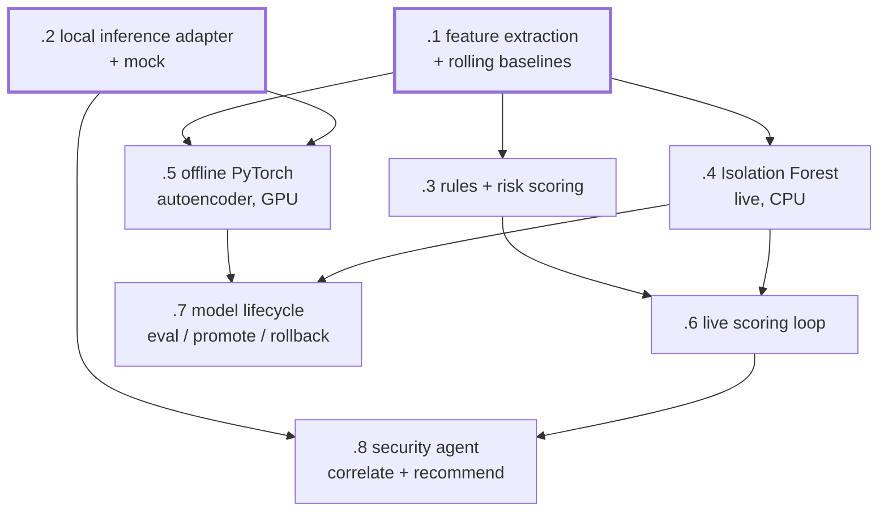

# dxnvh-0e6 — Component 3: refinement and processing

Turns canonical events into risk scores, findings, and one constrained policy
recommendation an analyst can approve. Three layers, three latency budgets.

| Bead | Title | Size | Model | Deps |
|---|---|---|---|---|
| `.1` | Feature extraction and rolling baselines | m | sonnet | — |
| `.2` | Local inference adapter with a mock, and no external fallback | m | sonnet | — |
| `.3` | Deterministic rules and risk scoring | m | sonnet | `.1` |
| `.4` | Small Isolation Forest live anomaly model on CPU | m | sonnet | `.1` |
| `.5` | Offline PyTorch sequence/autoencoder model over a safe snapshot | l | opus | `.1` `.2` |
| `.6` | Live scoring loop: poll canonical events, emit findings | m | sonnet | `.3` `.4` |
| `.7` | Evaluation, versioning, promotion and rollback | m | sonnet | `.5` `.4` |
| `.8` | Always-on OpenClaw security agent: correlate, explain, recommend | l | opus | `.2` `.6` |

Everything develops against fixtures and a mocked inference response, so this
molecule waits on no runtime, no GPU, and no running ingestion service.

## Watch for

**`.2` ships before anything that needs inference.** One interface, one mock,
one place a reviewer can check that no external provider fallback exists. This
is what keeps the component testable with no GPU and makes integration rule 10
verifiable rather than aspirational.

**Live scoring must degrade independently.** Integration rule 8 requires it to
keep working when offline processing or the inference route is down. So the live
path shares no process and no hard dependency with the agent or the GPU model.
`.4` also degrades to rules-only if its artifact fails to load.

**Deterministic evidence is not a fallback.** `.3` produces the itemised risk
contributions the dashboard renders first. The agent's prose is an enhancement
that may be absent, slow or empty. Build it that way from the start rather than
bolting degradation on later.

**The agent is an investigator, not an orchestrator.** Measured fan-out ceiling
is ~4 concurrent subagents on this class of host, and the layer causing that cap
is not fully identified. A design needing width would have to be re-architected
and re-measured first.

**Untrusted input is data, never instruction.** Squid logs, URLs, CVE text and
report content all reach the agent. `.8` is tested against a fixture carrying
prompt-injection text in a URL and a CVE description — it must not change the
agent's actions.

**Do not train on unresolved high-risk events as normal.** An unreviewed alert
is unlabelled, not benign. Treating it as benign teaches the model to ignore
exactly the behaviour it exists to catch. `.7` enforces this in the dataset
builder with a test.

**`.5` never opens the live database.** It requests a snapshot through the
ingestion API and records which snapshot id it used. Its memory envelope comes
from `dxnvh-bht.2` — unified memory means it contends with the always-on
inference backend rather than drawing from a separate budget.
