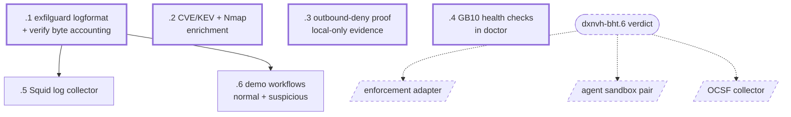

# dxnvh-0f2 — Component 1: infrastructure and sources

Produces the source activity every other component consumes, and the evidence
that nothing left the box.

| Bead | Title | Size | Deps |
|---|---|---|---|
| `.1` | Add the exfilguard logformat to `squid.conf`, verify byte accounting | s | — |
| `.2` | CVE/KEV snapshot and authorized Nmap scan as local enrichment | m | — |
| `.3` | Outbound-deny validation proving the appliance operates local-only | m | — |
| `.4` | GB10 GPU and runtime health checks wired into doctor | s | — |
| `.5` | Squid log collector: tail access.log and post to ingestion | m | `.1` |
| `.6` | Deterministic normal and suspicious business-agent workflows | m | `.1` |

Every bead here is runnable without the agent runtime, so this molecule is not
blocked on the spike.

## Deliberately not in this molecule

The OpenShell policy enforcement adapter, the agent sandbox pair, and the OCSF
collector. All three depend on `dxnvh-bht`'s verdict. `/bh:replan dxnvh-bht`
files them rather than writing them now against a guessed answer.

## Watch for

**Squid already exists.** `infra/gb10/docker-compose.squid.yml` and
`infra/gb10/squid/squid.conf` are deployed, with `access.log` landing in the
named `hack-squid-logs` volume. Squid writes as uid 13 (proxy), which is why
that is a named volume and not a host bind mount — `.5` must read it without
requiring a chowned host directory.

**Byte accounting is not trustworthy until measured.** `req_bytes` and
`resp_bytes` differ by Squid version and HTTPS mode. `.1` verifies them against
known-size transfers before any detector is built on them. A silently wrong byte
field poisons every downstream feature and is very hard to trace back from a bad
risk score.

**HTTPS visibility is bounded.** Without TLS interception Squid sees the CONNECT
destination and byte counts, not paths or filenames. The MVP does not enable
interception. Where request-size visibility is genuinely needed, `.6` uses a
controlled plain-HTTP upload of generated non-sensitive data. No bead here may
claim Squid identifies an uploaded file inside ordinary HTTPS traffic.

**The suspicious workflow must be a sequence.** Three or more correlated actions
ending in a transfer to a new destination — not one large POST. A single upload
is caught by a one-line rule and demonstrates nothing about correlation, which
is the entire justification for the offline model and the security agent.

**`.3` is the claim that closes the demo.** "No customer data, telemetry, or
inference leaves the GB10" needs an artifact the run produces, not an assertion.
Note the audit posture: there is no top-level audit switch — default-deny *is*
the audit posture, and a per-endpoint `:audit` rule allows and logs a host you
already named, which is the opposite of surfacing an unknown one.
