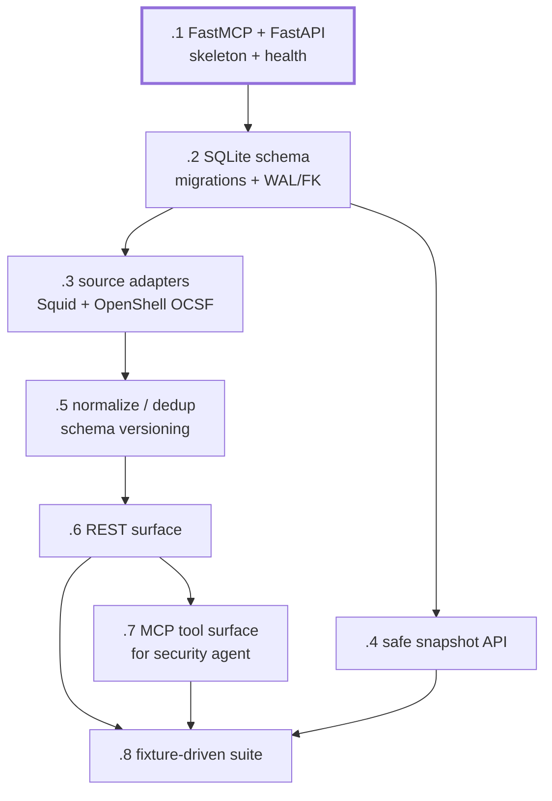

# dxnvh-2jb — Component 2: ingestion and storage

Owns the durable data and every versioned API the other three components talk
through. FastMCP mounted into FastAPI: REST for infra and the dashboard, MCP
tools for the security agent.

A single chain — this is the one molecule that is genuinely sequential, because
each layer needs the one below it to be real.

| Bead | Title | Size | Deps |
|---|---|---|---|
| `.1` | FastMCP + FastAPI service skeleton with MCP mounted and health | m | — |
| `.2` | SQLite schema, migrations, and the durability settings | m | `.1` |
| `.3` | Pluggable source-adapter interface with Squid and OpenShell adapters | m | `.2` |
| `.4` | Safe SQLite backup snapshot API for offline processing | m | `.2` |
| `.5` | Validation, normalization, deduplication and schema versioning | m | `.3` |
| `.6` | The versioned REST surface | l | `.5` |
| `.7` | MCP tool surface for the OpenClaw security agent | m | `.6` |
| `.8` | Fixture-driven test suite proving the component stands alone | m | `.6` `.7` `.4` |

## The boundary rule

**Only this component reads or writes SQLite.** Everything else goes through
versioned HTTP contracts or fixture files. That is what stops four people
coupling their work to database internals. `.8` asserts it by checking no other
component's code references a database path.

## Watch for

**FastMCP breaks silently without the lifespan.** `mcp.http_app()` returns an
ASGI app, and FastAPI must be constructed with `FastAPI(lifespan=mcp_app.lifespan)`
before mounting it. Omitting it produces broken session management rather than
an obvious error.

**MCP tools are a second façade, never a parallel implementation.** Tools and
REST handlers call the same repository functions. Two implementations drift, and
then the agent sees different data than the dashboard.

**Snapshots use SQLite's backup API, never a file copy.** A live WAL database
copied under load yields a torn snapshot, and the corruption surfaces much later
as an unreproducible training failure.

**Dedup is a contract obligation.** The collector is allowed to re-post after a
restart. Stable event ids derived from record content are what make replay safe
— and they are also what makes the end-to-end demo repeatable.

**`.6` is where three integration rules become mechanically true**: model output
is schema-validated, generative models cannot emit executable policy, and only
predefined analyst-approved actions reach the infrastructure adapter. The
`action_type` enum is enforced here and again in `.7`'s tool schema, so a
malformed recommendation fails at the protocol boundary before any handler code
runs.
