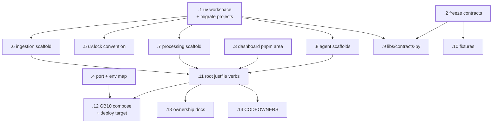

# dxnvh-332 — Foundation

uv workspace, frozen contracts, polyglot scaffold, GB10 build target.
Milestone 0 plus the plumbing four people on four laptops need before component
work can run in parallel.

Four roots, so four people can start at once. `.1` is the widest unblock.

| Bead | Title | Size | Deps |
|---|---|---|---|
| `.1` | Convert repo to a single uv workspace and migrate existing projects | m | — |
| `.2` | Freeze the four shared JSON contracts and their examples | m | — |
| `.3` | Scaffold `services/dashboard` as a pnpm TypeScript area | m | — |
| `.4` | Assign ports, service names and environment variables | s | — |
| `.5` | Establish the `uv.lock` regenerate-don't-merge convention | s | `.1` |
| `.6` | Scaffold `services/ingestion` as a workspace member | s | `.1` |
| `.7` | Scaffold `services/processing` as a workspace member | s | `.1` |
| `.8` | Scaffold the business-agent and security-agent projects | s | `.1` |
| `.9` | `libs/contracts-py`: typed models derived from the schemas | m | `.1` `.2` |
| `.10` | `fixtures/`: deterministic normal and suspicious sequences | m | `.2` |
| `.11` | Root justfile: uniform verbs across Python and TypeScript | m | `.6` `.7` `.3` `.8` |
| `.12` | GB10 application compose stack and build/deploy target | m | `.4` `.11` |
| `.13` | Update the ownership rule in CLAUDE.md and AGENTS.md | s | `.11` |
| `.14` | CODEOWNERS gating the shared surfaces | s | `.11` |

Batches: `.1`+`.5` (workspace-root), `.13`+`.14` (repo-conventions).

## Watch for

`.1` is a migration, not an addition — it deletes two existing `uv.lock` files
and rewrites `agents/hello-agent/pyproject.toml:12` from a path source to
`{ workspace = true }`. `scripts/new-agent.sh` copies that project as a template
and must stop reproducing the per-project lockfile pattern.

`.5` requires reproducing a real two-branch conflict and resolving it via the
documented steps. A convention nobody has executed once will not survive demo
week.

`.13` exists because both `CLAUDE.md` and `AGENTS.md` currently claim there is
no shared lockfile. After `.1` that is false, and a stale ownership rule is what
produces merge collisions.
