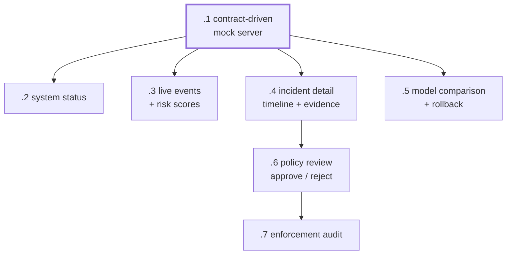

# dxnvh-7t2 — Component 4: UX and dashboard

The analyst's whole interface: understand why a sequence was flagged, approve or
reject a constrained policy, and see what enforcement actually did. TypeScript
and React on pnpm, outside the Python uv workspace.

`.1` unblocks everything, and every screen after it develops against fixtures —
no Squid, no ingestion, no processing, no model.

| Bead | Screen | Size | Deps |
|---|---|---|---|
| `.1` | Contract-driven mock server for standalone development | m | — |
| `.2` | System status | s | `.1` |
| `.3` | Live events with risk scores | m | `.1` |
| `.4` | Incident detail: cross-action timeline and evidence | l | `.1` |
| `.5` | Offline model comparison and rollback controls | m | `.1` |
| `.6` | Policy review and explicit approve/reject | m | `.4` |
| `.7` | Enforcement audit | m | `.6` |

The framework prototype one team member is developing drops into
`services/dashboard`, whose toolchain and verbs `dxnvh-332.3` scaffolds.

## Watch for

**Deterministic evidence renders first, model prose second.** This is a layout
and data-flow decision, not a fallback to add later. The timeline, the itemised
risk contributions and the raw events are the primary content; the agent's
investigation summary is an enhancement that can be absent, slow or empty
without leaving a blank screen. `.1` can serve a slow or failing summary on
demand so degradation is developed deliberately rather than discovered.

**The dashboard holds no authority of its own.** It reads and writes only
through ingestion's REST API — never SQLite, Squid, OpenShell or a model
directly. Approval is a decision *recorded*; the infrastructure adapter is what
applies policy, having polled the approved-policy feed. The UI cannot enforce
anything even if someone wires a button wrong.

**Approval is explicit and never inferred.** No default-approve, no
bulk-approve, no path where dismissing a dialog approves anything. `.6` is the
gate the entire safety story rests on.

**A drifting mock is the expensive failure.** `.1` is generated from or
validated against the same OpenAPI contract the real service serves, with a
check that fails on divergence. Otherwise the dashboard works perfectly right up
until integration day.

**`.2` surfaces a known GB10 failure mode.** Nothing reconciles which model vLLM
loads against which model LiteLLM advertises — a mismatch leaves `:4000` erroring
while `:8000` looks perfectly healthy. Showing the active model and route makes
that visible instead of silent.
