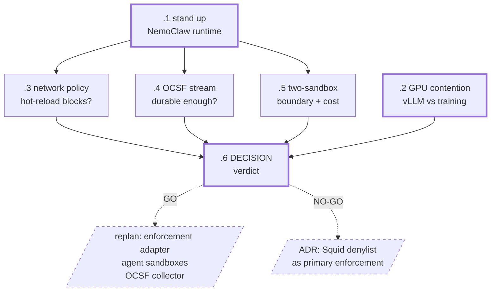

# dxnvh-bht — GB10 runtime spike

Settle OpenShell/NemoClaw behaviour on the GB10 before enforcement is designed.
Files no product code. Its verdict re-enters planning via `/bh:replan`.

| Bead | Question | Size | Deps |
|---|---|---|---|
| `.1` | Can the NemoClaw/OpenShell runtime stand up on aarch64 at all? | m | — |
| `.2` | Can nightly PyTorch training coexist with always-on vLLM on 119.7 GiB? | s | — |
| `.3` | Does `network_policies` hot-reload actually block, and is it legible? | m | `.1` |
| `.4` | Is the OCSF stream durable enough to be an event source? | m | `.1` |
| `.5` | Is the two-sandbox data boundary affordable and contained? | m | `.1` |
| `.6` | DECISION — carry the verdicts into enforcement and agent design | s | all |

Each spike writes `docs/spikes/<bead-id>-<slug>.md` with Question / Method /
Evidence / Verdict (GO|NO-GO) / Recommendation, and touches no product code.

## The gap being closed

| | Established on | GB10 |
|---|---|---|
| Arch | x86_64 | **aarch64** |
| Kernel | 6.12.94 | **6.17.0-1021-nvidia** |
| OpenShell | 0.0.85 | **0.0.91** |
| NemoClaw | v0.0.93 | **not installed** |
| Model | llama3.2:1b | **Qwen3.6-27B-FP8** |

`.3` is the highest-value bead in the molecule — it is the demo's climax. Only
the *allow* direction of the policy ratchet has ever been exercised; the MVP
needs the *deny* direction. Test it against a destination that is **not** the
inference route: `inference.local` is a built-in gateway route not governed by
user `network_policies`, so it cannot be denied this way and would give a
misleading result.

## Already settled — not spiked

- `inference.local` is reachable under default-deny but proxied and audited, not
  exempt.
- `filesystem_policy` / `landlock` / `process` are static; only
  `network_policies` hot-reload. Kernel-guaranteed monotonicity, transfers.
- Fan-out ceiling is ~4 concurrent subagents. The architecture needs two agents,
  so this constrains the security agent's design but gates nothing.

## Two claims expected to flip

`infra/gb10/README.md` lists `default-cgroupns-mode=host` as an unfixed known
issue. `openshell-egress-audit` records that fix as **obsolete from 0.0.85**
because the gateway now sets host cgroupns itself. The box runs 0.0.91. `.1`
settles which is true before anyone applies a stale fix.

`openshell-data-boundary` returns NO-GO on denial visibility because Landlock
gained audit-log emission in kernel **6.15** and that host ran 6.12. The GB10
runs 6.17, so the verdict may flip. `.5` re-runs the probe rather than assuming
either answer.

Where a spike refutes a claim in `libs/skills/`, correcting that skill text is
part of its recommendation — those skills load into every agent session in this
repo, and a stale verdict in them is worse than none because it is trusted.
