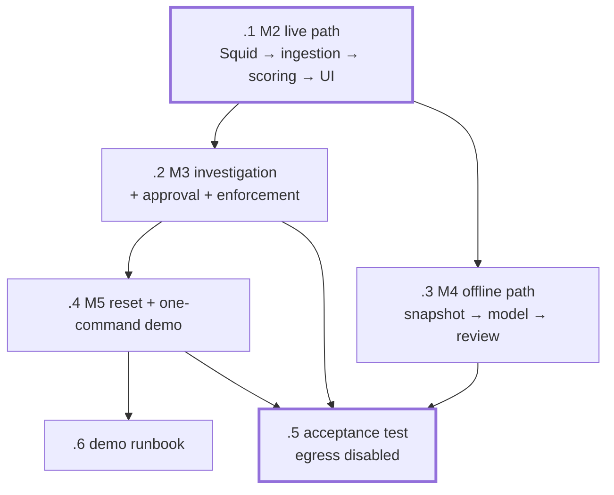

# dxnvh-xe5 — Integration and demo hardening

Milestones 2 through 5 plus the end-to-end acceptance test. Its own molecule
because cross-component work has no single component owner — assigning it inside
any one component epic would violate the ownership rule that keeps four
worktrees merging cleanly.

| Bead | Milestone | Size | Model | Deps |
|---|---|---|---|---|
| `.1` | M2 — connect the live path | m | sonnet | — |
| `.2` | M3 — security agent, approval, enforcement | l | opus | `.1` |
| `.3` | M4 — offline processing through snapshot to review | m | sonnet | `.1` |
| `.4` | M5 — reset script and one-command demo control | m | sonnet | `.2` |
| `.5` | The end-to-end acceptance test, run with egress disabled | l | opus | `.2` `.3` `.4` |
| `.6` | Demo runbook with failure modes and recovery | s | sonnet | `.4` |

## The rule for this molecule

Integration fixes **contract and wiring problems only**. If a component's
internal behaviour is wrong, that is a bead in that component's epic, driven by
its owner. Integration work that starts editing another component's internals is
how a four-person hackathon turns into one person debugging everything at 3am.

Contract mismatches get fixed in `contracts/` with all four components
realigned, never patched locally in one component.

## Watch for

**`.2`'s mechanism comes from the spike.** On GO, `deny_destination` maps to an
OpenShell `network_policies` update on the running sandbox — the only half of
policy that hot-reloads. On NO-GO, the Squid denylist is the enforcement point
instead. Measure the time from approval to the block taking effect; the demo
narrates that pause.

**The block needs positive evidence.** A real record from the enforcement point,
not inferred from the absence of traffic.

**`.4` is what makes the demo rehearsable.** Reset must return SQLite, Squid
policy *and any applied OpenShell policy* to a known state. A demo that cannot
be reset can only be rehearsed once, and the first live run is the wrong time to
discover that. Reset must not touch model weights — a rehearsal should not cost
a model reload.

**`.5` decides whether the project met its definition of success.** It asserts
outcomes rather than printing output for a human to judge: it fails loudly if
the suspicious sequence is not flagged, if the recommendation is not
constrained, if approval is bypassed, or if the repeat transfer is not blocked.
The artifact proving nothing left the GB10 is generated by the test, not
assembled by hand afterwards.

**`.6` writes down the known failure modes before demo day**, not during it: the
vLLM/LiteLLM serving mismatch, the OCSF ring buffer overrunning, inference slow
enough that deterministic evidence has to carry the narration, and enforcement
taking a measurable moment to bite.
