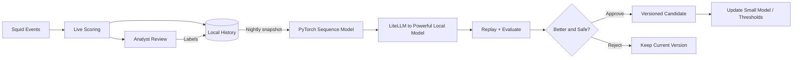
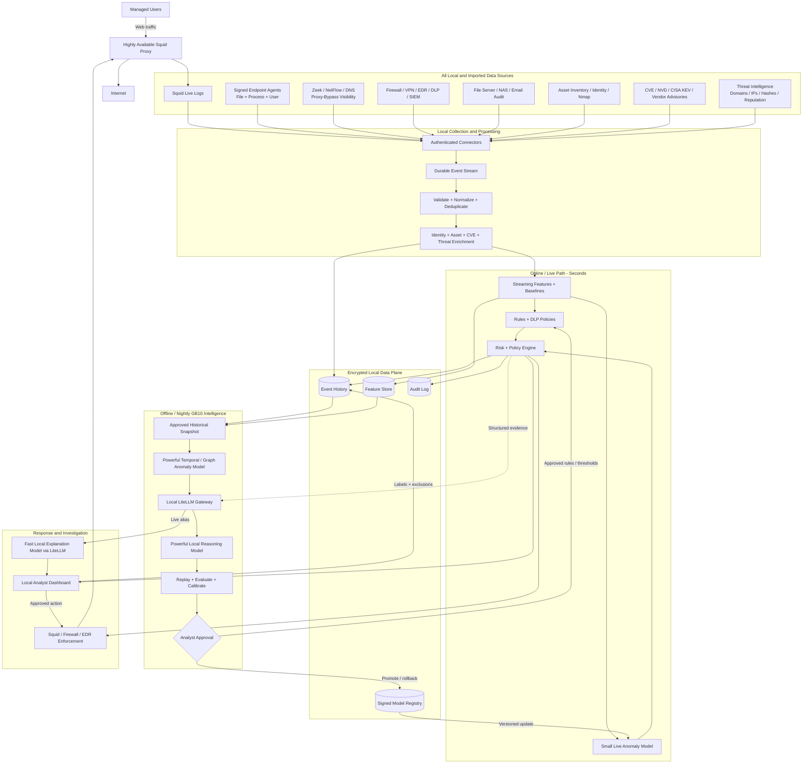

# Squid-Centered Local Exfiltration Protection

**Hackathon architecture with a path to production**

**Target:** Dell system with NVIDIA GB10

**Core rule:** Customer traffic metadata, events, models, and analysis stay on the appliance.

## 1. What we are building

For the hackathon, **Squid is the main collection and enforcement point**. Test clients use Squid as an explicit web proxy. A local collector streams Squid access logs into a fast anomaly detector. A more powerful GPU model analyzes the complete history offline each night and proposes improvements to the live detector.

Additional local context comes from:

- **CVE records and security advisories:** MITRE CVE, NIST NVD, CISA KEV, and vendor advisories.
- **Authorized Nmap discovery:** identifies test assets and services.
- **Analyst feedback:** marks alerts as normal or malicious.

CVEs add asset-risk context but do not directly prove exfiltration.

## 2. Hackathon MVP architecture

```mermaid
flowchart LR
    CLIENT[Test Clients]
    INTERNET[Test Internet Destination]

    subgraph Appliance[Local GB10 Appliance]
        SQUID[Squid Proxy] --> LOG[Squid access.log]
        LOG -->|Live tail| COLLECTOR[Log Collector]
        CVE[CVE + CISA KEV Snapshot] --> ENRICH
        NMAP[Authorized Nmap Scan] --> ENRICH

        COLLECTOR --> API[FastAPI Ingestion]
        API --> ENRICH[Normalize + Enrich]
        ENRICH --> DB[(PostgreSQL)]

        subgraph Online[Online / Live - Seconds]
            FEATURES[Squid Features]
            RULES[Rules + Rolling Baselines]
            SMALL[Small Isolation Forest]
            SCORE[Risk Score]
        end

        ENRICH --> FEATURES
        FEATURES --> RULES
        FEATURES --> SMALL
        RULES --> SCORE
        SMALL --> SCORE
        SCORE --> DB
        SCORE --> UI[Streamlit Dashboard]
        SCORE -.-> LITELLM[Local LiteLLM Gateway]
        LITELLM -->|Live model alias| LLM[Fast Local Explanation Model] --> UI

        subgraph Offline[Offline / Nightly - GPU]
            SNAPSHOT[Historical Snapshot]
            SEQUENCE[PyTorch Sequence / Autoencoder Model]
            POWERFUL[Powerful Local Model via LiteLLM]
            EVAL[Replay + Evaluate]
            APPROVE{Analyst Approval}
        end

        DB -->|Nightly| SNAPSHOT --> SEQUENCE --> LITELLM
        LITELLM -->|Offline model alias| POWERFUL --> EVAL --> APPROVE
        APPROVE -->|Thresholds / new small model| SMALL
        APPROVE -->|Deeper incidents| UI
        UI -->|Labels| DB

        POLICY[Local Denylist / ACL Policy]
        UI -->|Approved policy only| POLICY
        POLICY -.->|Future requests| SQUID
    end

    CLIENT -->|Explicit proxy| SQUID
    SQUID --> INTERNET
```



**Online** means fast, local event-time scoring. **Offline** means local batch analysis, normally run nightly. Neither means cloud processing.

### Important timing boundary

Squid normally writes an access-log record during or after a request. Therefore:

- The log stream can provide near-live detection and alerting.
- It cannot retroactively stop the first completed transfer.
- An approved denylist or Squid external ACL can block later requests before they start.
- The LLM and powerful offline model must never run inside Squid's request path.

For the hackathon, start in **observe mode**. Demonstrate that an approved policy blocks a repeated request to the same destination.

## 3. Minimal components

Use one Docker Compose deployment with six services:

| Component | Hackathon choice | Responsibility |
|---|---|---|
| Proxy | Squid | Routes test web traffic and writes access logs |
| API | FastAPI | Receives structured Squid events |
| Worker/collector | Python | Tails logs, normalizes events, scans, scores, and runs nightly jobs |
| Database | PostgreSQL | Events, baselines, assets, CVEs, labels, and model versions |
| Dashboard | Streamlit | Alerts, explanations, labels, policy, and model approval |
| Model service | PyTorch plus local LiteLLM gateway/backends | Offline anomaly model, fast explanation model, and powerful offline model |

PostgreSQL can also hold MVP jobs. Do not add Kafka, Kubernetes, a separate feature store, or production endpoint agents during the hackathon.

### Tool categories

The architecture uses generic capabilities. The named products are replaceable implementations.

| Generic category | What it does | MVP choice | Other/eventual options |
|---|---|---|---|
| Forward web proxy | Routes and controls user web traffic | **Squid** | Envoy or another enterprise secure web gateway |
| Proxy content adaptation | Sends approved decrypted HTTP content to a scanner | None for MVP | C-ICAP, custom ICAP, or eCAP service |
| Log collector/shipper | Tails, buffers, and forwards logs | Python collector | Vector, Fluent Bit, Filebeat, rsyslog |
| Ingestion API | Accepts normalized local events | FastAPI | Go service or enterprise event gateway |
| Event database | Stores events, labels, assets, and configuration | PostgreSQL | PostgreSQL plus an analytical/event store |
| Network metadata sensor | Describes traffic that may bypass the proxy | None for MVP | Zeek |
| IDS/IPS | Detects known network attacks and signatures | None for MVP | Suricata or Snort |
| Flow collector | Records source, destination, duration, and byte counts | Squid metadata only | NetFlow/IPFIX, ntopng |
| Endpoint telemetry agent | Identifies user, process, file, and device activity | Generated demo events | osquery, Wazuh, Sysmon, auditd, Falco, or a custom signed agent |
| Asset discovery | Finds authorized hosts and exposed services | Nmap | Enterprise asset inventory/CMDB |
| Vulnerability scanner | Tests assets for known weaknesses | Nmap context only | Greenbone/OpenVAS, Nessus, Nuclei, Trivy |
| Vulnerability intelligence | Supplies known vulnerability and exploitation context | Local CVE/NVD and CISA KEV snapshot | Vendor advisories and controlled feed synchronization |
| Threat intelligence | Supplies malicious domains, IPs, hashes, and reputation | Small local denylist | MISP, OpenCTI, or approved commercial/community feeds |
| Content/DLP classifier | Detects sensitive data when content is legitimately visible | Simulated sensitivity metadata | YARA, Presidio, Hyperscan, or an ICAP DLP service |
| Live anomaly detector | Scores each event quickly | scikit-learn Isolation Forest | Gradient-boosted model or distilled neural model |
| Offline anomaly trainer | Finds deeper historical or sequence anomalies | PyTorch autoencoder | Temporal transformer or graph model |
| Local model gateway | Gives applications one API for locally hosted models | LiteLLM | Direct backend APIs |
| Local inference backend | Executes the models on the GB10 GPU | Existing GB10 local backend | vLLM, llama.cpp, Ollama, or TensorRT-LLM |
| Analyst dashboard | Displays incidents and captures decisions | Streamlit | React application, Grafana, or SIEM integration |
| Enforcement point | Applies an approved response | Squid ACL/denylist | Squid external ACL, firewall, DNS filter, or EDR isolation |
| Deployment/orchestration | Installs and runs local services | Docker Compose | Kubernetes or an appliance installer |

For the hackathon, the shortest useful chain is:

```text
Squid (proxy)
  → Python collector (log shipper)
  → FastAPI (ingestion)
  → PostgreSQL (event store)
  → Isolation Forest (live anomaly detection)
  → Streamlit (analyst dashboard)
  → approved Squid ACL (enforcement)

Nightly PostgreSQL snapshot
  → PyTorch (offline anomaly detection)
  → LiteLLM (local model gateway)
  → powerful local model (correlation and explanation)
```

## 4. Squid live ingestion

### 4.1 Explicit proxy

Configure only the hackathon test clients to use the GB10 appliance as an explicit proxy, for example:

```text
Proxy host: gb10.local
Proxy port: 3128
```

Do not transparently redirect a business network during the demo.

### 4.2 Structured access log

Add a custom log format to `squid.conf`:

```conf
logformat exfilguard ts=%ts.%03tu src=%>a user=%un method=%rm uri=%ru status=%>Hs req_bytes=%>st resp_bytes=%<st mime=%mt result=%Ss
access_log /var/log/squid/access.log exfilguard

# Reduces demo latency; revisit for production throughput.
buffered_logs off
```

Validate and reload the configuration:

```bash
squid -k parse
squid -k reconfigure
```

Field availability and byte accounting can differ by Squid version and HTTPS mode. Verify `req_bytes` and `resp_bytes` with known test transfers before relying on them.

### 4.3 Collector

The worker tails `/var/log/squid/access.log` continuously and posts new records to FastAPI.

For the first demo, `tail -F` is acceptable. The collector should still:

- Remember its file position when possible.
- Handle log rotation.
- Buffer briefly if FastAPI is unavailable.
- Batch events under high volume.
- Avoid logging credentials or sensitive URL query parameters.

Vector or Fluent Bit can replace the Python tailer later without changing the API.

### 4.4 Normalized event

```json
{
  "timestamp": "2026-03-15T22:15:00Z",
  "source_type": "squid",
  "user": "alice",
  "source_ip": "10.0.0.17",
  "device": "laptop-17",
  "method": "POST",
  "destination": "unknown-storage.example",
  "request_bytes": 25000000,
  "response_bytes": 842,
  "status": 200,
  "outside_work_hours": true,
  "asset_has_kev": true
}
```

## 5. HTTPS limitation

Without TLS interception, Squid usually sees the HTTPS `CONNECT` destination but not the encrypted request path, filename, content, or reliable per-request details inside the tunnel.

The MVP will **not** enable TLS interception. It will use:

- Destination and connection metadata from normal HTTPS proxy traffic.
- A controlled HTTP test upload with non-sensitive generated data when request-size visibility is required.
- Simulated file-sensitivity metadata if that feature is shown in the dashboard.

A production endpoint agent or explicitly authorized ICAP/TLS inspection can add file-level context later. The architecture must not claim that Squid alone identifies the uploaded file inside ordinary HTTPS traffic.

## 6. Live detection model

The live path uses three simple signals:

1. Deterministic rules.
2. Per-user, source-IP, and destination rolling baselines.
3. A small Isolation Forest model running on CPU.

Initial Squid-derived features:

- Request method, especially `POST`, `PUT`, and `PATCH`
- `log(request_bytes + 1)` when available
- Destination new to the user or organization
- Transfer size relative to the user's baseline
- Requests and unique destinations in the last hour
- Activity outside normal working hours
- Squid allow/deny/result status
- Source asset matched to a CVE or CISA KEV entry

Example decision:

```text
Risk: 86/100
- New destination: +20
- 8x normal request size: +25
- POST outside working hours: +15
- Known-exploited vulnerability on source asset: +10
- Isolation Forest anomaly: +16
```

For the MVP, a model anomaly creates an alert. Blocking requires an analyst-approved destination or policy.

## 7. Squid enforcement

### MVP enforcement

Maintain a local file of approved denied domains:

```conf
acl exfil_denied dstdomain "/etc/squid/exfil-denied-domains.txt"
http_access deny exfil_denied
```

Place this deny rule before the general `http_access allow` rule. The dashboard adds a destination only after analyst approval. The worker then safely validates and reloads Squid. This demonstrates prevention on the next request without putting ML in the request path.

### Eventual live policy check

A production version can use a fast local `external_acl_type` helper:

```conf
external_acl_type exfil_policy ttl=10 negative_ttl=2 %SRC %LOGIN %DST /opt/exfil/check-policy
acl exfil_denied_dynamic external exfil_policy
http_access deny exfil_denied_dynamic
```

The helper may check only cached, deterministic policy such as a denied destination, restricted user, or isolated device. It must have strict timeouts and a defined fail-open/fail-closed policy. It must not call the LLM or GPU model.

## 8. Powerful offline model on the GB10

Each night, the GB10 runs a two-stage offline analysis over the local Squid history:

1. A **PyTorch autoencoder** processes numerical time-window and sequence features.
2. A **powerful local model accessed through LiteLLM** correlates the structured findings, CVE context, and analyst labels.

A temporal anomaly model can replace or extend the autoencoder after the MVP. LiteLLM provides the OpenAI-compatible gateway; all configured inference backends remain on the GB10.

The offline pipeline can analyze:

- A user's previous 20–100 proxy events
- 1-hour, 24-hour, and 7-day behavior
- Slow repeated uploads that look harmless individually
- Relationships among users, devices, and destinations
- CVE/KEV context for source assets
- Analyst-confirmed normal and malicious events

It produces:

- Deeper anomaly scores and related-event groups
- New incidents for review
- Recommended live thresholds
- Teacher-generated labels or a candidate small model

The offline models also support on-demand investigation. They are powerful but do not need to meet Squid request latency. The PyTorch model handles numerical anomaly detection; the powerful model behind LiteLLM handles correlation and structured reasoning.

### Safe learning loop



Do not train on unresolved high-risk events as if they were normal. Every promoted model is versioned and supports rollback.

## 9. Local LiteLLM model gateway

LiteLLM is the single OpenAI-compatible gateway for models hosted locally on the GB10. Configure at least two aliases:

```text
exfil-live     -> fast local model for asynchronous explanations
exfil-offline  -> powerful local model for nightly correlation and investigation
```

Application configuration can use:

```text
LITELLM_BASE_URL=http://litellm:4000/v1
LIVE_MODEL=exfil-live
OFFLINE_MODEL=exfil-offline
```

The live alias receives structured evidence after scoring and:

- Explains why a Squid event was flagged.
- Summarizes a user's related proxy activity.
- Adds relevant CVE/KEV context.
- Suggests investigation steps.

The offline alias receives larger, historical batches of structured findings and performs deeper correlation. Neither model modifies Squid policy directly.

LiteLLM must listen only on the private container network, require an internal API key, and have no external-provider fallback. Prompts and responses remain local. Squid logs, URLs, CVE text, and report content are untrusted data, not model instructions.

## 10. Hackathon demo

1. Start Docker Compose on the GB10.
2. Configure one test client or `curl` to use Squid.
3. Load a local CVE/NVD sample and CISA KEV snapshot.
4. Run Nmap against one authorized test subnet and associate a test asset with a KEV.
5. Generate several normal requests through Squid.
6. Send a large, off-hours test upload to a new destination through Squid.
7. Stream the Squid log into FastAPI and score it immediately.
8. Show the risk evidence and local-LLM explanation in Streamlit.
9. Label the event and trigger the nightly GPU job manually.
10. Show the powerful model's deeper result and candidate threshold/model.
11. Approve the candidate or roll it back.
12. Approve the suspicious destination for the denylist, repeat the request, and show Squid blocking it.

## 11. Installation on the GB10

1. Install Docker, Docker Compose, the NVIDIA driver, and NVIDIA Container Toolkit.
2. Verify GPU access with `nvidia-smi`.
3. Check `uname -m`; use `linux/arm64` images if the Grace-based host requires them.
4. Download models once and store them locally on the GB10.
5. Configure LiteLLM with local-only `exfil-live` and `exfil-offline` model aliases; do not configure external-provider fallbacks.
6. Start Squid, FastAPI, PostgreSQL, the worker, Streamlit, LiteLLM, and the local inference backends.
7. Bind-mount the Squid log directory read-only into the worker.
8. Load the CVE/KEV snapshot and configure one authorized scan range.
9. Expose port 3128 only to test clients, restrict the dashboard to the management network, and keep LiteLLM private to the container network.

Suggested resource allocation:

- CPU: Squid, API, PostgreSQL, collector, rules, and small live model
- GPU: PyTorch offline model and the local models routed through LiteLLM
- Disk: Squid history, normalized events, CVEs, labels, models, and audit history

A connected installation can refresh CVE data through an allowlisted outbound-only updater that sends no customer data. An air-gapped installation imports a signed update bundle.

## 12. Four-person split

### Member 1 — Squid and live collection

- Squid container and explicit-proxy configuration
- Structured log format and collector
- Test traffic and upload generator
- Denylist/reload integration

### Member 2 — Processing and live detection

- FastAPI ingestion and normalized event schema
- Rolling baselines and feature extraction
- Rules, Isolation Forest, and risk score
- CVE/Nmap enrichment

### Member 3 — Powerful offline model

- PyTorch autoencoder and nightly job
- Historical windows and training exclusions
- Evaluation, model versions, promotion, and rollback
- Optional teacher-to-small-model update

### Member 4 — Dashboard, LLM, and GB10 deployment

- Streamlit alerts and analyst labels
- LiteLLM integration and local model aliases
- Local model explanations
- Policy and model approval screens
- Docker Compose and GB10 GPU setup

## 13. Eventual business architecture

The MVP begins with Squid, but the eventual product combines proxy, endpoint, network, business-system, vulnerability, and threat-intelligence data.

| Stage | Data sources |
|---|---|
| Hackathon MVP | Squid, generated test traffic, Nmap, and a local CVE/KEV snapshot |
| Next step | Zeek or NetFlow, DNS, identity/asset inventory, and threat-intelligence feeds |
| Business product | Signed endpoint agents, EDR/DLP/SIEM, firewall/VPN, file/email audit data, and vendor advisories |



### How the eventual model works

1. The **small live model** scores every event quickly using current features and approved nightly updates.
2. The **powerful temporal/graph model** finds slow or cross-entity patterns over the complete local history.
3. The **powerful model behind LiteLLM** correlates structured findings and creates investigation summaries.
4. Replay and evaluation determine whether a candidate improves detection without exceeding the alert budget.
5. An analyst approves new model versions, thresholds, and rules before they enter the live path.
6. The dashboard can approve enforcement through Squid, a firewall, or EDR; no generative model enforces directly.

Production additions include high availability, RBAC, encrypted backups, retention controls, tamper-evident audit logs, signed connectors and model artifacts, staged enforcement, and health monitoring.

## 14. Definition of success

> A test upload passes through Squid, its log is scored locally within seconds, and the alert is explained in the dashboard. The powerful GB10 model later analyzes the broader history and proposes a reviewed improvement. An analyst can approve a policy that causes Squid to block the next matching request, with no customer telemetry leaving the appliance.
