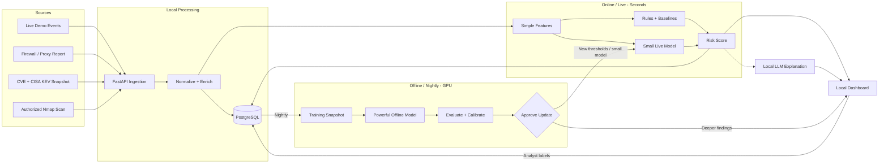
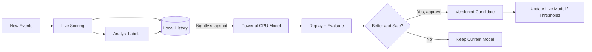
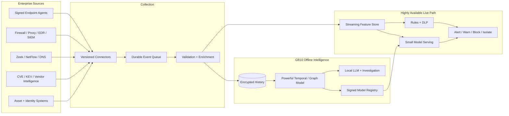

# Local-Only Exfiltration Protection

**Hackathon architecture with a path to production**

**Target:** Dell system with NVIDIA GB10

**Core rule:** Customer events, models, and analysis stay on the appliance.

## 1. What we are building

A local appliance that collects security activity, detects unusual outbound behavior live, and uses a more powerful GPU model overnight to find deeper patterns and improve the live detector.

The term previously written as “CVS reports” means **CVE (Common Vulnerabilities and Exposures) records and online security advisories**, such as MITRE CVE, NIST NVD, CISA KEV, and vendor advisories. CVEs provide risk context; they do not directly prove exfiltration.

## 2. Hackathon MVP

Build one Docker Compose application on the GB10. Do not build production endpoint agents or a distributed platform during the hackathon.

### MVP architecture



**Online** means the fast event-time path running locally. **Offline** means local batch processing, normally run nightly. It does not mean cloud processing.

### What to demo

1. Load a local CVE/NVD and CISA KEV snapshot.
2. Import one sample firewall or Squid report.
3. Run an authorized Nmap scan against a small test subnet.
4. Generate live events representing normal transfers.
5. Generate one suspicious event: a large, off-hours upload to a new destination from a vulnerable asset.
6. Score it immediately with rules, baselines, and the small live model.
7. Show the alert and local-LLM explanation in the dashboard.
8. Let an analyst label it normal or malicious.
9. Trigger the “nightly” GPU job manually for the demo.
10. Show the powerful offline model finding the anomaly and proposing an updated live model or threshold.
11. Approve the update and show model version/rollback.

## 3. Keep the MVP small

### Five application components

| Component | Hackathon choice | Responsibility |
|---|---|---|
| API | FastAPI | Receive files and live events |
| Database | PostgreSQL | Events, assets, CVEs, labels, and model metadata |
| Worker | Python | Normalize, scan, score, and run scheduled jobs |
| Dashboard | Streamlit | Alerts, explanations, labels, and model approval |
| Model server | PyTorch plus Ollama/llama.cpp | Offline GPU model and local LLM |

PostgreSQL can act as the job queue for the MVP. Do not add Kafka, a feature store, Kubernetes, or multiple databases yet.

### MVP data sources

Use only four sources:

- **Live event generator:** simulates endpoint or network-transfer events.
- **One internal report:** a sample Squid, firewall, DLP, or SIEM CSV/JSON export.
- **CVE snapshot:** a downloaded NVD/CVE sample plus CISA KEV catalog, stored locally.
- **Nmap:** scans only an explicitly configured test subnet.

If time permits, tail a real Squid log. A production endpoint agent can come later.

### Minimal event format

```json
{
  "timestamp": "2026-03-15T22:15:00Z",
  "user": "alice",
  "device": "laptop-17",
  "process": "browser",
  "destination": "unknown-storage.example",
  "bytes_sent": 25000000,
  "file_sensitivity": "confidential",
  "outside_work_hours": true,
  "asset_has_kev": true
}
```

## 4. Models

### Small live model

The live path must respond quickly and remain explainable. Use:

1. Deterministic rules.
2. Per-user/device rolling baselines.
3. A small Isolation Forest model.

Initial features:

- `log(bytes_sent + 1)`
- New destination for user
- New destination for organization
- Transfer size relative to user baseline
- Outside normal working hours
- Sensitive file indicator
- Number of uploads in the last hour
- Asset has a matching CVE or CISA KEV entry

Example decision:

```text
Risk: 91/100
- New destination: +20
- 8x normal transfer size: +25
- Confidential file: +20
- Outside working hours: +10
- Known-exploited vulnerability on device: +10
- Isolation Forest anomaly: +6
```

For the MVP, only alert. Do not automatically block based solely on an unsupervised score.

### Powerful offline model

The GB10 runs a more powerful model over historical sequences during the nightly job. For the hackathon, use a **PyTorch autoencoder** over time-window features. If the team has time, replace or extend it with a temporal transformer after the MVP.

The offline model can use features that are too expensive for every live request:

- Sequences of the user’s last 20–100 events
- Activity over 1-hour, 24-hour, and 7-day windows
- Relationships among users, devices, processes, and destinations
- Slow, repeated transfers that individually look normal
- CVE/KEV context for the source asset
- Analyst-confirmed normal and malicious activity

It produces:

- A deeper anomaly score for historical events
- Groups of related suspicious events
- Recommended live thresholds
- A candidate small model or teacher-generated labels
- New incidents for analyst review

The powerful model remains available for on-demand investigations as well as the nightly run. It does not need to sit in the sub-second live path.

### Learning loop



Do not train directly on unresolved high-risk events. Otherwise, repeated malicious activity can become part of the “normal” baseline. Every promoted model is versioned and can be rolled back.

### Local LLM

The local LLM is not the anomaly detector. It receives structured evidence and:

- Explains why an event was flagged.
- Summarizes related events.
- Suggests investigation steps.
- Helps map unfamiliar report columns.

It recommends actions but does not execute blocking commands. Logs, filenames, CVE text, and report content are untrusted input and cannot be treated as instructions.

## 5. Installation on the GB10

For the hackathon:

1. Install Docker, Docker Compose, the NVIDIA driver, and NVIDIA Container Toolkit.
2. Verify GPU access with `nvidia-smi`.
3. Verify whether the host is ARM64 with `uname -m`; use `linux/arm64` images if required.
4. Download model files once, then run all model inference locally.
5. Start the API, PostgreSQL, worker, dashboard, and model server with Docker Compose.
6. Import the CVE/KEV snapshot and sample security report.
7. Configure one authorized scan range.
8. Open only the dashboard and ingestion ports on the internal network.

The CVE snapshot can be refreshed through an allowlisted outbound-only updater that sends no customer data. A fully air-gapped business can import a signed update bundle instead.

Suggested resource use:

- CPU: API, PostgreSQL, rules, and small live model
- GPU: powerful offline model and local LLM
- Disk: events, CVE database, model versions, and audit history

## 6. Four-person split

### Member 1 — Sources and ingestion

- FastAPI ingestion
- Sample report importer
- CVE/KEV snapshot loader
- Live event generator

### Member 2 — Processing and live detection

- Normalization and feature extraction
- Rolling baselines and rules
- Isolation Forest scoring
- Risk-score explanations

### Member 3 — Powerful offline model

- PyTorch autoencoder and nightly job
- Training dataset and exclusions
- Evaluation, candidate versions, and rollback
- Optional teacher-to-small-model update

### Member 4 — Dashboard and deployment

- Streamlit dashboard
- Local LLM explanations
- Analyst labels and model approval
- Docker Compose and GB10 setup

## 7. Eventual production architecture

After the hackathon, the same data flow can be expanded without changing the core design.



Production additions include signed endpoint agents, high availability, RBAC, encrypted backups, retention controls, tamper-evident audit logs, signed model artifacts, staged enforcement, and integrations with firewalls or EDR systems.

## 8. Definition of hackathon success

The MVP succeeds if it can demonstrate this story locally on the GB10:

> A live transfer arrives, receives an immediate explainable risk score, and appears in the dashboard. That night, the powerful GPU model analyzes the broader sequence, finds deeper evidence, and proposes an improvement. An analyst reviews and promotes the improvement without any customer data leaving the appliance.
