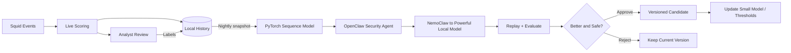
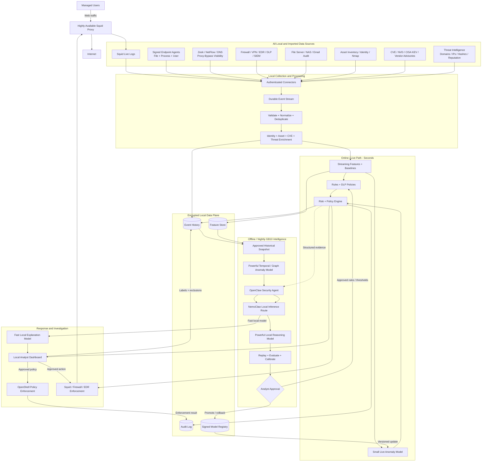

# Squid-Centered Local Exfiltration Protection

**Hackathon architecture with a path to production**

**Target:** Dell system with NVIDIA GB10

**Core rule:** Customer traffic metadata, events, models, and analysis stay on the appliance.

## 1. What we are building

For the hackathon, an **OpenClaw business agent runs inside OpenShell**, with Squid as the first network data source. A local collector streams Squid and OpenShell activity into a fast anomaly detector. A more powerful GPU model analyzes the complete history offline, and an always-on OpenClaw security agent investigates suspicious cross-action sequences using NemoClaw-routed local inference.

The four independent workstreams, contracts, repository layout, and integration milestones are defined in [Modular Hackathon Implementation Plan](./modular-implementation-plan.md).

Additional local context comes from:

- **CVE records and security advisories:** MITRE CVE, NIST NVD, CISA KEV, and vendor advisories.
- **Authorized Nmap discovery:** identifies test assets and services.
- **Analyst feedback:** marks alerts as normal or malicious.

CVEs add asset-risk context but do not directly prove exfiltration.

## 2. Hackathon MVP architecture

```mermaid
flowchart LR
    INTERNET[Test Internet Destination]

    subgraph Appliance[Local GB10 Appliance]
        BUSINESS[OpenClaw Business Agent] --> SHELL[OpenShell Runtime]
        SHELL --> SQUID[Squid Proxy]
        SQUID --> LOG[Squid access.log]
        SHELL --> ACTIONS[OpenShell Action / Audit Events]

        LOG --> COLLECTOR[Source Adapters]
        ACTIONS --> COLLECTOR
        CVE[CVE + CISA KEV Snapshot] --> ENRICH
        NMAP[Authorized Nmap Scan] --> ENRICH

        COLLECTOR --> API[FastAPI Ingestion]
        API --> ENRICH[Normalize + Enrich]
        ENRICH --> DB[(SQLite - Ingestion Only)]

        subgraph Online[Online / Live - Seconds]
            FEATURES[Features + Rolling Baselines]
            RULES[Rules]
            SMALL[Small Isolation Forest]
            SCORE[Risk Score]
        end

        ENRICH --> FEATURES
        FEATURES --> RULES
        FEATURES --> SMALL
        RULES --> SCORE
        SMALL --> SCORE
        SCORE --> DB

        subgraph Offline[Offline / Nightly - GPU]
            SNAPSHOT[Safe SQLite Snapshot]
            SEQUENCE[PyTorch Sequence Model]
            EVAL[Replay + Evaluate]
        end

        DB -->|Nightly| SNAPSHOT --> SEQUENCE --> EVAL

        SCORE --> SECURITY[Always-On OpenClaw Security Agent]
        EVAL --> SECURITY
        SECURITY --> NEMO[NemoClaw Local Inference Route]
        NEMO --> LOCALMODEL[Local GB10 Models]
        LOCALMODEL --> FINDING[Finding + Constrained Recommendation]
        FINDING --> DB
        DB --> UI[Web Dashboard]

        UI -->|Analyst approval| POLICY[Approved Policy Adapter]
        POLICY -->|Constrained policy| SHELL
        POLICY -.->|Optional destination ACL| SQUID
        SHELL -->|Block result| ACTIONS
    end

    SQUID --> INTERNET
```



**Online** means fast, local event-time scoring. **Offline** means local batch analysis, normally run nightly. Neither means cloud processing.

### Important timing boundary

Squid normally writes an access-log record during or after a request. Therefore:

- The log stream can provide near-live detection and alerting.
- It cannot retroactively stop the first completed transfer.
- An approved denylist or Squid external ACL can block later requests before they start.
- The LLM and powerful offline model must never run inside Squid's request path.

For the hackathon, start in **observe mode**. Demonstrate that an analyst-approved, constrained policy is applied by OpenShell and blocks a repeated transfer. Squid ACL enforcement remains an optional second enforcement example.

## 3. Minimal components

Group the runtime into four independently owned components:

| Component | Hackathon technologies | Responsibility |
|---|---|---|
| Infrastructure and sources | Docker Compose, Squid, OpenShell, OpenClaw business agent | Produce source activity and apply approved policy |
| Ingestion and storage | FastAPI, source adapters, SQLite | Normalize events, own durable data, and expose versioned APIs |
| Refinement and processing | Python, scikit-learn, PyTorch, OpenClaw security agent, NemoClaw local inference | Live/offline detection, investigation, and constrained recommendations |
| UX and dashboard | Local web application | Evidence, labels, policy approval, enforcement audit, and model review |

SQLite is sufficient for a single-node hackathon appliance. Enable WAL mode, foreign keys, and a busy timeout. Keep the database on a local GB10 disk, let FastAPI own writes, and have other containers use the API instead of sharing concurrent write access to the SQLite file. Create nightly training snapshots with SQLite's backup API rather than copying an active database file. Do not add Kafka, Kubernetes, a separate feature store, or production endpoint agents during the hackathon.

### Tool categories

The architecture uses generic capabilities. The named products are replaceable implementations.

| Generic category | What it does | MVP choice | Other/eventual options |
|---|---|---|---|
| Agent runtime and policy sandbox | Runs business-agent actions under enforceable local policy | **OpenShell** | Another constrained local workload runtime |
| Business automation agent | Performs the normal workflow being protected | **OpenClaw business agent** | Business applications and managed user workflows |
| Security investigation agent | Correlates evidence and proposes constrained policy | **OpenClaw security agent** | A custom local investigation service |
| Forward web proxy | Routes and controls user web traffic | **Squid** | Envoy or another enterprise secure web gateway |
| Proxy content adaptation | Sends approved decrypted HTTP content to a scanner | None for MVP | C-ICAP, custom ICAP, or eCAP service |
| Log collector/shipper | Tails, buffers, and forwards logs | Python collector | Vector, Fluent Bit, Filebeat, rsyslog |
| Ingestion API | Accepts normalized local events | FastAPI | Go service or enterprise event gateway |
| Event database | Stores events, labels, assets, and configuration | SQLite | PostgreSQL plus an analytical/event store for production scale |
| Network metadata sensor | Describes traffic that may bypass the proxy | None for MVP | Zeek |
| IDS/IPS | Detects known network attacks and signatures | None for MVP | Suricata or Snort |
| Flow collector | Records source, destination, duration, and byte counts | Squid metadata only | NetFlow/IPFIX, ntopng |
| Endpoint telemetry agent | Identifies user, process, file, and device activity | Generated demo events | osquery, Wazuh, Sysmon, auditd, Falco, or a custom signed agent |
| Asset discovery | Finds authorized hosts and exposed services | Nmap | Enterprise asset inventory/CMDB |
| Vulnerability scanner | Tests assets for known weaknesses | Nmap context only | Greenbone/OpenVAS, Nessus, Nuclei, Trivy |
| Vulnerability intelligence | Supplies known vulnerability and exploitation context | Local CVE/NVD and CISA KEV snapshot | Vendor advisories and controlled feed synchronization |
| Threat intelligence | Supplies malicious domains, IPs, hashes, and reputation | Small local denylist | MISP, OpenCTI, or approved commercial/community feeds |
| Content/DLP classifier | Detects sensitive data when content is legitimately visible | Simulated sensitivity metadata | YARA, Presidio, Hyperscan, or an ICAP DLP service |
| Live anomaly detector | Scores each event quickly | scikit-learn Isolation Forest | Gradient-boosted model or distilled neural model |
| Offline anomaly trainer | Finds deeper historical or sequence anomalies | PyTorch autoencoder | Temporal transformer or graph model |
| Agent inference route | Routes OpenClaw security-agent inference locally | NemoClaw | A versioned internal inference adapter |
| Local model gateway | Gives applications one API for locally hosted models | Existing LiteLLM endpoint, behind the local route where required | Direct backend APIs |
| Local inference backend | Executes the models on the GB10 GPU | Existing GB10 local backend | vLLM, llama.cpp, Ollama, or TensorRT-LLM |
| Analyst dashboard | Displays incidents and captures decisions | Streamlit | React application, Grafana, or SIEM integration |
| Enforcement point | Applies an approved response | OpenShell policy adapter; optional Squid ACL | Squid external ACL, firewall, DNS filter, or EDR isolation |
| Deployment/orchestration | Installs and runs local services | Docker Compose | Kubernetes or an appliance installer |

For the hackathon, the shortest useful chain is:

```text
OpenClaw business agent
  → OpenShell (agent runtime and policy enforcement)
  → Squid (proxy)
  → Python collector (log shipper)
  → FastAPI (ingestion)
  → SQLite (embedded event store)
  → Isolation Forest (live anomaly detection)
  → web dashboard (analyst approval)
  → approved OpenShell policy (enforcement)

Nightly SQLite snapshot
  → PyTorch (offline anomaly detection)
  → OpenClaw security agent
  → NemoClaw (local inference route)
  → local GB10 model (correlation and recommendation)
```

## 4. Squid live ingestion

### 4.1 Explicit proxy

Configure only the hackathon test clients to use the GB10 appliance as an explicit proxy, for example:

```text
Proxy host: gb10.local
Proxy port: 3128
```

Do not transparently redirect a business network during the demo.

### 4.2 Structured access log

Add a custom log format to `squid.conf`:

```conf
logformat exfilguard ts=%ts.%03tu src=%>a user=%un method=%rm uri=%ru status=%>Hs req_bytes=%>st resp_bytes=%<st mime=%mt result=%Ss
access_log /var/log/squid/access.log exfilguard

# Reduces demo latency; revisit for production throughput.
buffered_logs off
```

Validate and reload the configuration:

```bash
squid -k parse
squid -k reconfigure
```

Field availability and byte accounting can differ by Squid version and HTTPS mode. Verify `req_bytes` and `resp_bytes` with known test transfers before relying on them.

### 4.3 Collector

The worker tails `/var/log/squid/access.log` continuously and posts new records to FastAPI.

For the first demo, `tail -F` is acceptable. The collector should still:

- Remember its file position when possible.
- Handle log rotation.
- Buffer briefly if FastAPI is unavailable.
- Batch events under high volume.
- Avoid logging credentials or sensitive URL query parameters.

Vector or Fluent Bit can replace the Python tailer later without changing the API.

### 4.4 Normalized event

```json
{
  "timestamp": "2026-03-15T22:15:00Z",
  "source_type": "squid",
  "user": "alice",
  "source_ip": "10.0.0.17",
  "device": "laptop-17",
  "method": "POST",
  "destination": "unknown-storage.example",
  "request_bytes": 25000000,
  "response_bytes": 842,
  "status": 200,
  "outside_work_hours": true,
  "asset_has_kev": true
}
```

## 5. HTTPS limitation

Without TLS interception, Squid usually sees the HTTPS `CONNECT` destination but not the encrypted request path, filename, content, or reliable per-request details inside the tunnel.

The MVP will **not** enable TLS interception. It will use:

- Destination and connection metadata from normal HTTPS proxy traffic.
- A controlled HTTP test upload with non-sensitive generated data when request-size visibility is required.
- Simulated file-sensitivity metadata if that feature is shown in the dashboard.

A production endpoint agent or explicitly authorized ICAP/TLS inspection can add file-level context later. The architecture must not claim that Squid alone identifies the uploaded file inside ordinary HTTPS traffic.

## 6. Live detection model

The live path uses three simple signals:

1. Deterministic rules.
2. Per-user, source-IP, and destination rolling baselines.
3. A small Isolation Forest model running on CPU.

Initial Squid-derived features:

- Request method, especially `POST`, `PUT`, and `PATCH`
- `log(request_bytes + 1)` when available
- Destination new to the user or organization
- Transfer size relative to the user's baseline
- Requests and unique destinations in the last hour
- Activity outside normal working hours
- Squid allow/deny/result status
- Source asset matched to a CVE or CISA KEV entry

Example decision:

```text
Risk: 86/100
- New destination: +20
- 8x normal request size: +25
- POST outside working hours: +15
- Known-exploited vulnerability on source asset: +10
- Isolation Forest anomaly: +16
```

For the MVP, a model anomaly creates an alert. Blocking requires an analyst-approved destination or policy.

## 7. Squid enforcement

### MVP enforcement

Maintain a local file of approved denied domains:

```conf
acl exfil_denied dstdomain "/etc/squid/exfil-denied-domains.txt"
http_access deny exfil_denied
```

Place this deny rule before the general `http_access allow` rule. The dashboard adds a destination only after analyst approval. The worker then safely validates and reloads Squid. This demonstrates prevention on the next request without putting ML in the request path.

### Eventual live policy check

A production version can use a fast local `external_acl_type` helper:

```conf
external_acl_type exfil_policy ttl=10 negative_ttl=2 %SRC %LOGIN %DST /opt/exfil/check-policy
acl exfil_denied_dynamic external exfil_policy
http_access deny exfil_denied_dynamic
```

The helper may check only cached, deterministic policy such as a denied destination, restricted user, or isolated device. It must have strict timeouts and a defined fail-open/fail-closed policy. It must not call the LLM or GPU model.

## 8. Powerful offline model on the GB10

Each night, the GB10 runs a two-stage offline analysis over the local event history:

1. A **PyTorch autoencoder** processes numerical time-window and cross-action sequence features.
2. The **OpenClaw security agent** investigates structured findings using NemoClaw-routed local inference and a powerful model hosted on the GB10.

A temporal anomaly model can replace or extend the autoencoder after the MVP. The existing LiteLLM endpoint may remain as the local model-provider adapter behind this boundary, but processing code depends only on the NemoClaw/local-inference contract. All inference remains on the GB10.

The offline pipeline can analyze:

- A user's previous 20–100 proxy events
- 1-hour, 24-hour, and 7-day behavior
- Slow repeated uploads that look harmless individually
- Relationships among users, devices, and destinations
- CVE/KEV context for source assets
- Analyst-confirmed normal and malicious events

It produces:

- Deeper anomaly scores and related-event groups
- New incidents for review
- Recommended live thresholds
- Teacher-generated labels or a candidate small model

The offline models also support on-demand investigation. They are powerful but do not need to meet Squid request latency. The PyTorch model handles numerical anomaly detection; the OpenClaw security agent and NemoClaw-routed model handle correlation and structured reasoning.

### Safe learning loop



Do not train on unresolved high-risk events as if they were normal. Every promoted model is versioned and supports rollback.

## 9. OpenClaw security agent and local inference

The always-on OpenClaw security agent owns investigation orchestration. It receives structured evidence from live and offline detectors, then uses **NemoClaw-routed inference that terminates at models hosted locally on the GB10**.

The existing LiteLLM endpoint can remain an implementation detail behind the local inference adapter if required. Other components must not depend directly on a specific model server. This keeps the processing module independently testable with a mocked inference response.

The security agent:

- Correlates Squid and OpenShell actions into a timeline.
- Explains why a cross-action sequence was flagged.
- Adds relevant CVE/KEV context.
- Produces a schema-validated finding.
- Suggests one constrained policy action for analyst review.

It cannot modify Squid or OpenShell directly. It cannot produce executable shell commands. Its recommendation must use an allowlisted action such as `deny_destination`, include a target and scope, and pass explicit analyst approval.

NemoClaw and any local model gateway must listen only on private GB10 interfaces, authenticate internal callers, and have no external-provider fallback. Prompts and responses remain local. Squid logs, URLs, CVE text, and report content are untrusted data, not model instructions.

## 10. Hackathon demo

1. Start all local services on the GB10.
2. Run an OpenClaw business agent inside OpenShell.
3. Let the business agent perform a normal workflow through Squid.
4. Ingest and normalize the Squid and OpenShell events into SQLite.
5. Run a suspicious cross-action sequence ending in a test transfer.
6. Detect it with the live rules/model and optionally trigger the offline job manually.
7. Let the always-on OpenClaw security agent investigate using NemoClaw-routed local inference.
8. Show deterministic evidence, the local investigation, and a constrained recommendation in the web dashboard.
9. Have an analyst explicitly approve the policy.
10. Apply it through the OpenShell policy adapter.
11. Repeat the transfer and show OpenShell blocking it.
12. Show the enforcement audit event and prove that no customer data, telemetry, or inference left the GB10.

## 11. Installation on the GB10

1. Install Docker, Docker Compose, the NVIDIA driver, and NVIDIA Container Toolkit.
2. Verify GPU access with `nvidia-smi`.
3. Check `uname -m`; use `linux/arm64` images if the Grace-based host requires them.
4. Download models once and store them locally on the GB10.
5. Configure OpenShell, the OpenClaw business/security agents, and NemoClaw-routed local inference with no external-provider fallback.
6. Start Squid, FastAPI with SQLite, processing, the web dashboard, NemoClaw, and the local inference backends.
7. Store the SQLite file on a persistent local volume and enable WAL mode, foreign keys, and a busy timeout.
8. Bind-mount the Squid log directory read-only into the worker.
9. Load the CVE/KEV snapshot and configure one authorized scan range.
10. Expose port 3128 only to test clients, restrict the dashboard to the management network, and keep NemoClaw/model endpoints private to the GB10 network.

Suggested resource allocation:

- CPU: Squid, API/SQLite, collector, rules, and small live model
- GPU: PyTorch offline model and local models routed through NemoClaw
- Disk: persistent SQLite database, Squid logs, models, and audit exports

A connected installation can refresh CVE data through an allowlisted outbound-only updater that sends no customer data. An air-gapped installation imports a signed update bundle.

## 12. Four independent components

### Component 1 — Infrastructure and sources

- Docker Compose and GB10 runtime
- Squid now; Zeek and other sensors through adapters later
- OpenShell and the OpenClaw business-agent workflow
- Deterministic demo traffic and raw event fixtures
- Constrained OpenShell/Squid policy enforcement adapter

### Component 2 — Ingestion and storage

- Squid and OpenShell source adapters
- FastAPI ingestion and versioned canonical-event schema
- Validation, normalization, and deduplication
- Exclusive ownership of SQLite, migrations, and snapshot API
- Data/query APIs for processing, dashboard, and infrastructure

### Component 3 — Refinement and processing

- Live feature extraction, baselines, rules, and Isolation Forest
- Offline PyTorch sequence/autoencoder model
- Always-on OpenClaw security agent
- NemoClaw-routed local inference
- Findings, constrained recommendations, evaluation, and model versions

### Component 4 — UX and dashboard

- Local web dashboard and service status
- Cross-action incident timeline and deterministic evidence
- Security-agent investigation summary
- Analyst labels and explicit policy approval
- Enforcement audit, model comparison, and rollback controls

Components communicate only through versioned contracts. SQLite is private to ingestion, model output is schema validated, and only predefined analyst-approved actions reach infrastructure. See the [modular implementation plan](./modular-implementation-plan.md) for APIs, fixtures, ownership, branches, milestones, and acceptance tests.

## 13. Eventual business architecture

The MVP begins with Squid, but the eventual product combines proxy, endpoint, network, business-system, vulnerability, and threat-intelligence data.

| Stage | Data sources |
|---|---|
| Hackathon MVP | Squid, generated test traffic, Nmap, and a local CVE/KEV snapshot |
| Next step | Zeek or NetFlow, DNS, identity/asset inventory, and threat-intelligence feeds |
| Business product | Signed endpoint agents, EDR/DLP/SIEM, firewall/VPN, file/email audit data, and vendor advisories |



### How the eventual model works

1. The **small live model** scores every event quickly using current features and approved nightly updates.
2. The **powerful temporal/graph model** finds slow or cross-entity patterns over the complete local history.
3. The **OpenClaw security agent using NemoClaw-routed local inference** correlates structured findings and creates investigation summaries and constrained recommendations.
4. Replay and evaluation determine whether a candidate improves detection without exceeding the alert budget.
5. An analyst approves new model versions, thresholds, and rules before they enter the live path.
6. The dashboard can approve enforcement through Squid, a firewall, or EDR; no generative model enforces directly.

Production additions include high availability, RBAC, encrypted backups, retention controls, tamper-evident audit logs, signed connectors and model artifacts, staged enforcement, and health monitoring.

## 14. Definition of success

> A locally running OpenClaw business agent performs normal work inside OpenShell. A suspicious cross-action sequence is detected locally, an always-on OpenClaw security agent investigates it using NemoClaw-routed local inference, an analyst approves the recommended policy, and OpenShell blocks the repeated transfer. No customer data, telemetry, or inference leaves the GB10.
