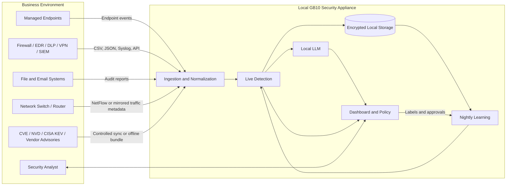
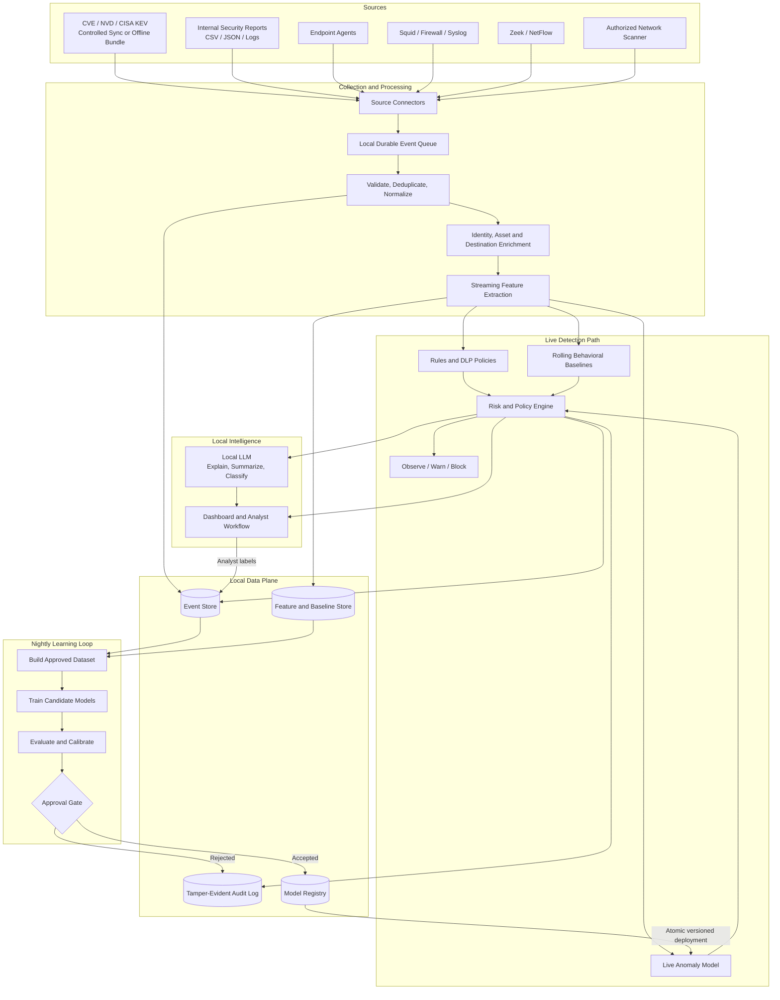

# Local-Only Exfiltration Protection Platform

**Architecture document**  
**Status:** Hackathon design / production-oriented MVP  
**Target platform:** Dell system with NVIDIA GB10  
**Deployment model:** Fully on-premises; no customer telemetry or content leaves the organization

## 1. Purpose

Build an installable, local-only platform that detects potential data exfiltration from CVE vulnerability intelligence, internal security telemetry, and live activity. It continuously updates behavioral baselines, scores live events, and performs a gated nightly learning cycle.

The platform should:

- Import CVE records and security advisories from approved vulnerability-intelligence sources.
- Import historical internal security reports delivered as CSV, JSON, or log files when available.
- Receive live events from endpoints, proxies, firewalls, and network sensors.
- Periodically discover assets on administrator-authorized internal networks.
- Detect known policy violations and anomalous behavior.
- Explain and correlate incidents with a local LLM.
- Learn from recent activity and analyst feedback without sending data to the cloud.
- Start in observe mode and support warn/block modes after validation.

> **Terminology:** The correct term is **CVE (Common Vulnerabilities and Exposures) records and related online security advisories**. Typical sources include MITRE CVE, NIST NVD, CISA Known Exploited Vulnerabilities (KEV), and vendor advisories. These feeds describe known vulnerabilities; they are different from internal security-event reports and CSV files.

## 2. Architecture principles

1. **Local by design:** collection, storage, inference, training, LLM processing, and administration remain on-premises.
2. **Metadata first:** collect file content only when explicitly configured and permitted. Prefer hashes, labels, headers, paths, and transfer metadata.
3. **Fast deterministic path:** rules and lightweight anomaly models handle live scoring. The LLM is not in the mandatory blocking path.
4. **Human-gated learning:** live baselines may update incrementally, but candidate model promotion requires evaluation and approval.
5. **Explainable decisions:** every alert includes the rules, features, and behavioral deviations that raised its score.
6. **Fail safely:** loss of the ML or LLM service must not interrupt ordinary business traffic unless an administrator explicitly chooses fail-closed enforcement.
7. **Authorized collection:** network scanning and monitoring are limited to administrator-approved assets and subnets.

## 3. System context



## 4. Data sources

### 4.1 CVE and vulnerability intelligence

The platform maintains a local vulnerability-intelligence database from approved sources:

| Source | Typical data | Ingestion method |
|---|---|---|
| MITRE CVE | CVE identifiers and descriptions | Controlled feed sync or offline bundle |
| NIST NVD | CVSS scores, affected products, and references | API/feed sync or offline bundle |
| CISA KEV | Vulnerabilities known to be exploited | Catalog sync or offline bundle |
| Vendor advisories | Product-specific fixes and mitigations | Approved connector or manual import |

The enrichment service maps discovered software, services, and asset inventory to applicable CVEs. CVE data does not directly prove exfiltration; it raises context and priority—for example, a device with a known exploited vulnerability making an unusual outbound transfer.

For a connected on-premises installation, a restricted updater may make outbound-only requests to an allowlist of approved feed hosts. It sends no customer events, asset details, or model data. For a strictly air-gapped installation, an administrator imports a signed vulnerability-feed bundle from removable media or an internal update mirror.

### 4.2 Historical and scheduled internal security reports

When available, the customer exports or schedules reports from existing internal systems:

| Source | Typical data | Ingestion method |
|---|---|---|
| Firewall | Connections, bytes, ports, allow/deny | CSV/JSON, Syslog, local API |
| Squid or web proxy | User, destination, method, result | Log tail, Syslog, scheduled report |
| EDR/antivirus | Process, user, device, file activity | CSV/JSON, local API |
| DLP product | Policy matches and incident labels | CSV/JSON |
| VPN | User, device, source, session activity | CSV/Syslog |
| SIEM | Correlated historical events | Scheduled CSV/JSON export |
| File server/NAS | File access, copy, and permission events | Audit report or agent |
| Email gateway | Attachments, recipients, policy results | Report or Syslog |
| Asset/identity systems | Device owner, department, role | CSV or local directory connector |

Supported report delivery for the MVP:

- Manual upload through the dashboard.
- Watched local directory, for example `/var/lib/exfil-guard/import/`.
- Read-only internal network share.
- Scheduled internal API pull.

### 4.3 Live data

- **Endpoint agent:** user, device, process, file metadata, destination, and transfer action.
- **Squid:** web destination and proxy activity. Squid is optional and does not cover all exfiltration channels.
- **Zeek/Suricata or NetFlow/IPFIX:** DNS and connection metadata, including unmanaged devices.
- **Firewall/Syslog:** live network decisions and flow summaries.
- **File-system auditing:** access to sensitive files when supported by the operating system.

HTTPS payloads remain encrypted unless the organization separately authorizes TLS inspection. TLS interception is not required for the MVP.

### 4.4 Periodic network discovery

A scheduler runs throttled discovery only against configured subnets. Discovery produces asset events such as new hosts, changed services, and unexpected externally reachable services. It is supporting context rather than direct proof of exfiltration.

## 5. Logical architecture



## 6. End-to-end flows

### 6.1 Live event flow

1. A connector receives an endpoint, proxy, firewall, or network event.
2. The event is authenticated, validated, deduplicated, and normalized.
3. The enrichment service adds known user, device, department, destination, sensitivity, and applicable CVE/KEV context.
4. Streaming features compare the event with user, device, department, and organizational behavior.
5. Rules, rolling baselines, and the live anomaly model independently produce evidence.
6. The risk engine combines evidence into a calibrated score and policy decision.
7. The event and decision are persisted locally.
8. The dashboard receives an alert. The local LLM may generate a summary and recommended investigation steps.
9. If configured, a deterministic enforcement adapter warns the user, denies a proxy request, or requests endpoint isolation.

Target latency for ordinary event scoring is less than one second. LLM output may arrive asynchronously and must not delay the initial alert.

### 6.2 Live learning

“Live learning” is intentionally constrained:

- Rolling counters, medians, median absolute deviation, destination familiarity, and time-window features update continuously.
- Confirmed incidents and unresolved high-risk events are excluded from normal baseline updates.
- Analyst labels are stored immediately but do not rewrite the production model.
- The deployed model artifact remains immutable until a candidate passes the nightly gate.

This prevents an attacker from making malicious behavior appear normal through repetition.

### 6.3 Nightly learning loop

1. Snapshot an approved time range from the event and feature stores.
2. Exclude confirmed incidents, unresolved high-risk events, corrupted records, and untrusted devices.
3. Apply analyst labels and approved exceptions.
4. Train baseline and anomaly-model candidates.
5. Evaluate candidates against labeled incidents, replay data, and synthetic exfiltration scenarios.
6. Calibrate thresholds against an alert budget, such as alerts per analyst per day.
7. Compare the candidate with the active model.
8. Register the candidate with its metrics, dataset version, configuration, and checksum.
9. Require analyst approval for promotion during the MVP.
10. Atomically activate the approved model; retain immediate rollback to the previous version.

## 7. Canonical event model

```json
{
  "event_id": "01J...",
  "timestamp": "2026-03-15T22:15:00Z",
  "source_type": "endpoint",
  "source_product": "exfil-guard-agent",
  "user_id": "alice",
  "device_id": "LAPTOP-17",
  "department": "finance",
  "process": "chrome.exe",
  "action": "upload",
  "destination": "unknown-storage.example",
  "destination_ip": "203.0.113.10",
  "protocol": "HTTPS",
  "bytes_sent": 25000000,
  "file_name": "payroll.csv",
  "file_type": "csv",
  "file_hash": "sha256:...",
  "sensitivity": "confidential",
  "labels": [],
  "raw_reference": "local://events/2026/03/15/..."
}
```

Raw source records should be retained only according to customer policy. Sensitive fields should be tokenized or omitted when they are unnecessary for detection.

## 8. Detection architecture

### 8.1 Rules and DLP policies

Rules handle known, explainable conditions:

- Confidential data sent to an unapproved destination.
- Blocked protocol or external storage provider.
- Secret pattern found by an explicitly enabled content scanner.
- Transfer by an unauthorized process or account.
- Large transfer outside approved hours.

### 8.2 Behavioral baselines

Maintain robust baselines per user, device, department, process, destination, and organization. Useful features include:

- `log(bytes_sent + 1)`
- Bytes relative to the user's and department's median
- New destination for the user or organization
- Upload count and unique destinations over 10-minute, 1-hour, 24-hour, and 7-day windows
- Activity outside the entity's normal hours
- File sensitivity
- Process-to-destination rarity
- Upload/download ratio
- Device or identity risk status

Use median and median absolute deviation where possible to reduce sensitivity to outliers.

### 8.3 Live anomaly model

The MVP uses an Isolation Forest or similarly lightweight unsupervised model. It is fast, works with mostly normal historical data, and runs efficiently on CPU. Rules and baseline scores are combined with the model score rather than replaced by it.

Example policy bands:

| Score | Default action |
|---:|---|
| 0–39 | Store only |
| 40–69 | Low-priority alert |
| 70–84 | Warn and request review |
| 85–100 | Block only when an approved deterministic policy also matches |

Thresholds must be calibrated for each organization.

### 8.4 Offline model

After the MVP, the GB10 GPU can train an autoencoder or sequence model over windows of user activity. Reconstruction or sequence prediction error becomes an additional signal. The existing rule and baseline paths remain available for explanation and fallback.

### 8.5 Evaluation

Track:

- Precision among the highest-risk alerts
- Recall against confirmed and synthetic incidents
- False positives per user and per analyst per day
- Detection and processing latency
- Performance across departments and device types
- Drift in feature distributions
- Candidate-versus-active model regressions

Synthetic tests should include large uploads, repeated small uploads, unusual destinations, off-hours transfers, unusual processes, and gradual low-and-slow transfer patterns.

## 9. Local LLM role

The local LLM is an analyst-assistance component. It can:

- Turn structured evidence into a concise incident explanation.
- Summarize related events and analyst notes.
- Classify approved metadata or limited content samples by sensitivity.
- Suggest mappings for unfamiliar CSV report columns.
- Translate analyst questions into constrained, read-only internal queries.
- Draft detection rules or response recommendations for human approval.

The LLM must not:

- Inspect every packet.
- directly execute arbitrary commands or blocking actions.
- replace deterministic policy checks.
- treat log text, filenames, report fields, or file contents as trusted instructions.

LLM calls use minimized, structured context. Outputs conform to a validated schema and are logged. The model server listens only on an internal container network and has no outbound network access.

## 10. Deployment on the Dell GB10

### 10.1 Appliance services

```text
Docker Compose / local container runtime
├── reverse-proxy
├── dashboard
├── ingestion-api
├── connector-workers
├── event-queue
├── normalization-worker
├── feature-worker
├── live-detection-service
├── policy-service
├── nightly-training-service
├── local-llm-service
├── postgres
├── model-registry
└── optional: squid, zeek, scanner
```

Suggested MVP technologies:

| Capability | Technology |
|---|---|
| API | Python and FastAPI |
| Durable stream | Redis Streams; use a disk-backed broker later if required |
| Event/configuration database | PostgreSQL |
| Feature processing | Polars/Pandas for MVP |
| Live anomaly model | scikit-learn Isolation Forest |
| GPU offline model | PyTorch |
| LLM runtime | llama.cpp, Ollama, or vLLM with a locally stored model |
| Dashboard | React or server-rendered FastAPI UI |
| Network metadata | Zeek or NetFlow collector |
| Web proxy integration | Existing or bundled Squid |
| Discovery | Throttled scanner against approved subnets |

If the GB10 host uses an ARM64 Grace CPU, every image and native dependency must support `linux/arm64`. CUDA, the NVIDIA container runtime, and GPU visibility should be verified during installation. Allocate CPU to live detection and storage; reserve GPU capacity for the local LLM and offline neural training.

### 10.2 Network placement

- Connect the appliance management interface to an administrator-only network.
- Expose the ingestion endpoint only to approved internal networks.
- Optionally connect a monitoring interface to a switch SPAN/TAP.
- Receive NetFlow/IPFIX or Syslog from existing network equipment.
- Configure Squid as an explicit proxy only where desired; managed endpoints can receive proxy settings through GPO, MDM, or a PAC file.
- Deny appliance outbound internet access after installation and model provisioning, except for an optional allowlisted CVE/advisory update service. The updater sends no customer telemetry; air-gapped deployments use signed offline bundles.

### 10.3 Enforcement modes

1. **Observe:** score, store, and alert only.
2. **Warn:** notify the user or analyst and request confirmation.
3. **Enforce:** block only approved high-confidence policy conditions.

New installations default to observe mode.

## 11. Security and operations

- Use mutual TLS or per-agent certificates for endpoint ingestion.
- Encrypt disks and database backups; keep keys in an OS keystore or available hardware-backed store.
- Implement role-based access for administrators and analysts.
- Sign agents, model artifacts, rules, and update bundles.
- Record configuration, model promotion, enforcement, and analyst actions in an append-only audit trail.
- Define retention separately for raw records, normalized events, features, and incidents.
- Back up configuration, policies, model registry metadata, and analyst labels locally.
- Support model and policy rollback.
- Pin dependencies and scan the offline installation bundle before deployment.
- Require explicit configuration of scanned networks and content-inspection policies.

## 12. Failure behavior

| Failure | Default behavior |
|---|---|
| LLM unavailable | Detection continues; explanations are deferred |
| Nightly training fails | Keep active model; alert administrator |
| Live model unavailable | Continue rules and robust baselines |
| Queue/database temporarily unavailable | Buffer locally with bounded storage and backpressure |
| Endpoint agent disconnected | Report stale agent; use available network metadata |
| Proxy integration unavailable | Do not interrupt traffic unless fail-closed was explicitly selected |
| Candidate model regresses | Reject candidate and retain active version |

## 13. Hackathon MVP scope

Demonstrate one complete scenario:

1. Import a local snapshot of CVE/NVD and CISA KEV vulnerability intelligence.
2. Match discovered test assets to applicable CVEs and add that context to events.
3. Import historical firewall, proxy, or DLP reports in CSV format when sample reports are available.
4. Receive simulated or real endpoint transfer metadata live.
5. Ingest Squid, firewall, or Zeek connection events.
6. Run discovery against a small authorized test subnet.
7. Build rolling user and destination baselines.
8. Score events with rules and Isolation Forest.
9. Detect a confidential, unusually large upload from a vulnerable asset to a new destination.
10. Display anomaly evidence, relevant CVE/KEV context, and a local-LLM explanation.
11. Allow the analyst to mark the event normal or malicious.
12. Run the nightly candidate-training loop and show model comparison, approval, promotion, and rollback.
13. Disconnect internet access and show that ingestion, inference, learning, and the dashboard continue to operate using the local vulnerability snapshot.

## 14. Four-person implementation split

### Member 1 — Ingestion and schema

- Canonical event schema
- CVE/NVD/KEV feed importer and local vulnerability database
- CSV/JSON internal-report importer and watched directory
- Live ingestion API and queue
- Validation, normalization, and synthetic data generator

### Member 2 — Sensors and asset discovery

- Squid/Syslog/Zeek or NetFlow connector
- Endpoint-agent prototype
- Authorized network discovery scheduler
- Asset and destination enrichment

### Member 3 — Detection and learning

- Streaming features and rolling baselines
- Rules and risk engine
- Isolation Forest live model
- Nightly training, evaluation, model registry, and rollback

### Member 4 — LLM, dashboard, and deployment

- Local LLM service and structured prompts
- Incident dashboard and analyst feedback
- Observe/warn/enforce workflow
- GB10 Docker Compose bundle, authentication, and audit UI

## 15. Decisions to confirm

- Exact Dell GB10 model, operating system, CPU architecture, RAM, and available GPU runtime.
- Which CVE/advisory sources are required: MITRE CVE, NVD, CISA KEV, and/or vendor advisories.
- Whether feed updates use controlled internet access, an internal mirror, or signed offline bundles.
- Which internal report products and sample CSV schemas are available for the demo.
- Whether the demo uses Squid, Zeek, NetFlow, or simulated network events.
- Endpoint operating systems and what metadata the prototype may collect.
- Whether active blocking is in hackathon scope or demonstrated as a simulated action.
- Retention, privacy, and content-inspection requirements.
