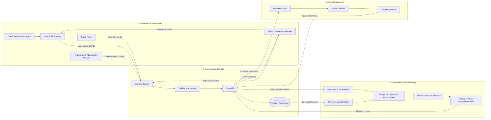

# Modular Hackathon Implementation Plan

## 1. Demo objective

> A locally running OpenClaw business agent performs normal work inside OpenShell. A suspicious cross-action sequence is detected locally. An always-on OpenClaw security agent investigates it using NemoClaw-routed local inference. An analyst approves the recommended policy, and OpenShell blocks the repeated transfer. No customer data, telemetry, or inference leaves the GB10.

The implementation is split into four independently testable components:

1. **Infrastructure and sources**
2. **Ingestion and storage**
3. **Refinement and processing**
4. **UX and dashboard**

Squid is the first network source. Zeek, endpoint telemetry, and other sources can be added later through the same ingestion contract.

## 2. Modular architecture



### Boundary rule

**Only the ingestion component reads or writes SQLite.** Every other component communicates through versioned HTTP contracts or fixture files. This prevents four people from coupling their work to database internals.

## 3. Shared contracts to freeze first

The team should agree on these contracts before implementing components. Store schemas and examples in `contracts/`.

### 3.1 Canonical event

```json
{
  "schema_version": "1.0",
  "event_id": "evt-001",
  "timestamp": "2026-03-15T22:15:00Z",
  "source_type": "squid",
  "actor": "business-agent",
  "user": "alice",
  "device": "gb10",
  "action": "http_upload",
  "destination": "test-storage.local",
  "request_bytes": 25000000,
  "attributes": {
    "method": "POST",
    "outside_work_hours": true,
    "asset_has_kev": false
  }
}
```

### 3.2 Finding

```json
{
  "schema_version": "1.0",
  "finding_id": "finding-001",
  "event_ids": ["evt-001", "evt-002", "evt-003"],
  "risk_score": 91,
  "severity": "high",
  "detectors": ["new_destination", "sequence_anomaly"],
  "summary": "Repeated staging followed by a large upload to a new destination.",
  "model_version": "offline-001"
}
```

### 3.3 Policy recommendation

```json
{
  "schema_version": "1.0",
  "recommendation_id": "rec-001",
  "finding_id": "finding-001",
  "action_type": "deny_destination",
  "target": "test-storage.local",
  "scope": "business-agent",
  "reason": "Confirmed suspicious cross-action sequence",
  "expires_at": "2026-03-16T22:15:00Z"
}
```

Only predefined `action_type` values are accepted. Model-generated shell commands are never accepted.

### 3.4 Approval and enforcement result

```json
{
  "recommendation_id": "rec-001",
  "decision": "approved",
  "analyst": "demo-analyst",
  "timestamp": "2026-03-15T22:20:00Z"
}
```

```json
{
  "recommendation_id": "rec-001",
  "status": "applied",
  "enforcement_point": "openshell",
  "policy_version": "policy-004"
}
```

## 4. Minimal APIs

The ingestion service owns the durable API:

| Endpoint | Producer/consumer | Purpose |
|---|---|---|
| `POST /v1/events` | Infra → ingestion | Submit raw or canonical events |
| `GET /v1/events?after_id=` | Processing | Poll new canonical events for the MVP |
| `POST /v1/findings` | Processing → ingestion | Store findings and evidence |
| `GET /v1/findings` | Dashboard | List and inspect incidents |
| `POST /v1/findings/{id}/labels` | Dashboard | Add analyst feedback |
| `POST /v1/recommendations` | Security agent → ingestion | Store a constrained policy recommendation |
| `POST /v1/recommendations/{id}/decision` | Dashboard | Approve or reject a recommendation |
| `GET /v1/policies/approved?after_id=` | Infra | Poll policies ready for enforcement |
| `POST /v1/enforcement-results` | Infra → ingestion | Record applied or failed actions |
| `POST /v1/snapshots` | Offline processor | Request a safe SQLite backup snapshot |
| `GET /v1/snapshots/{id}` | Offline processor | Download/read the completed snapshot |
| `GET /health` | All components | Readiness check |

Polling is sufficient for the hackathon. A durable stream can replace it later without changing event schemas.

## 5. Component work plans

### Component 1 — Infrastructure and sources

**Owner:** Infrastructure engineer

#### Responsibilities

- Docker Compose and local networking
- Squid proxy, structured access logs, and test-client configuration
- OpenShell runtime for the OpenClaw business agent
- Repeatable normal and suspicious demo workflows
- Policy enforcement adapter for OpenShell
- Optional Squid denylist adapter
- GB10 GPU/runtime health checks
- Outbound-deny validation proving local-only operation

#### Inputs

- Approved policy contract from ingestion
- Shared service configuration and secrets

#### Outputs

- Squid raw log fixture
- OpenShell action/audit event fixture
- Raw events sent to `POST /v1/events`
- Enforcement results sent to `POST /v1/enforcement-results`

#### Independent test

1. Start Squid and OpenShell.
2. Run the business agent's normal workflow.
3. Run the suspicious upload workflow.
4. Confirm deterministic raw logs/events are produced.
5. Feed a fixture approved policy to the adapter.
6. Confirm OpenShell blocks the repeated transfer.

#### Definition of done

- `docker compose up` starts the required infrastructure.
- A scripted demo can be replayed reliably.
- Enforcement accepts only allowlisted policy actions.
- OpenShell and Squid actions are audited.

### Component 2 — Ingestion and storage

**Owner:** Data/backend engineer

#### Responsibilities

- FastAPI service
- Pluggable source-adapter interface
- Squid and OpenShell adapters for the MVP
- Validation, normalization, deduplication, and schema versioning
- SQLite schema and migrations
- WAL mode, foreign keys, and busy timeout
- Safe SQLite backup API for offline processing
- Query APIs used by processing and dashboard

#### SQLite tables

- `raw_events`
- `events`
- `findings`
- `finding_events`
- `labels`
- `policy_recommendations`
- `policy_decisions`
- `enforcement_results`
- `model_versions`

#### Inputs

- Raw Squid/OpenShell fixtures from infrastructure
- Findings and recommendations from processing
- Labels and decisions from the dashboard

#### Outputs

- Canonical event API
- Incident/query API
- Approved-policy API
- Safe nightly snapshot

#### Independent test

Use checked-in fixtures without requiring Squid, OpenShell, or models. Submit duplicate and malformed records, then verify normalization, rejection, deduplication, and query behavior.

#### Definition of done

- Only this service accesses the SQLite file.
- Contract examples pass schema validation.
- Replayed records do not create duplicate events.
- A live database can be safely snapshotted through the backup API.

### Component 3 — Refinement and processing

**Owner:** ML/agent engineer

#### Responsibilities

- Feature extraction from canonical events
- Live rules, rolling baselines, and Isolation Forest
- Offline PyTorch sequence/autoencoder model
- Cross-action sequence correlation
- Always-on OpenClaw security agent
- NemoClaw-routed local inference on the GB10
- Structured findings and constrained policy recommendations
- Model evaluation, versioning, promotion, and rollback logic

#### Live path

```text
Canonical event
  → feature extraction
  → rules + rolling baseline + small model
  → risk score/finding
  → ingestion API
```

#### Offline path

```text
Safe SQLite snapshot
  → historical windows
  → PyTorch sequence model
  → structured evidence
  → OpenClaw security agent
  → NemoClaw local inference
  → finding + policy recommendation
  → evaluation and approval candidate
```

#### Inputs

- Canonical-event fixture/API
- Snapshot fixture
- Analyst labels

#### Outputs

- Finding contract
- Policy-recommendation contract
- Model candidate and metrics

#### Independent test

Run against fixture events and a fixture snapshot. Use a mocked NemoClaw response until local inference is available. Verify the processor emits schema-valid findings and only allowlisted policy action types.

#### Definition of done

- Live fixture is scored within the agreed latency target.
- Suspicious cross-action sequence produces a high-risk finding.
- Normal workflow remains below the alert threshold.
- Offline run is repeatable and versioned.
- No inference request leaves the GB10.

### Component 4 — UX and dashboard

**Owner:** Frontend/product engineer

#### Responsibilities

- Local web dashboard
- Event and incident timeline
- Live/offline detector evidence
- OpenClaw security-agent investigation summary
- Policy recommendation review
- Explicit approve/reject workflow
- Model candidate comparison and rollback controls
- Enforcement status and audit history

#### Required screens

1. **System status:** Squid, OpenShell, ingestion, processing, NemoClaw, and models.
2. **Live events:** recent normalized actions and risk scores.
3. **Incident detail:** cross-action timeline, evidence, model versions, and local-agent summary.
4. **Policy review:** constrained action, target, scope, expiry, and approve/reject buttons.
5. **Enforcement audit:** applied/failed policy and repeated-transfer result.
6. **Offline models:** active and candidate versions with evaluation metrics.

#### Inputs

- Fixture API matching the ingestion OpenAPI contract
- Findings, recommendations, and model metrics

#### Outputs

- Analyst labels and decisions through ingestion APIs
- No direct SQLite, Squid, OpenShell, or model access

#### Independent test

Develop against a mock server populated with shared contract fixtures. Demonstrate the complete review flow without running Squid or a model.

#### Definition of done

- Analyst can understand why the sequence was flagged.
- No policy is applied without explicit approval.
- Applied policy and enforcement outcome are visible.
- UI survives unavailable LLM explanations and shows deterministic evidence first.

## 6. Repository layout and ownership

```text
contracts/                         # Shared schemas; changes require team review
  event.schema.json
  finding.schema.json
  policy-recommendation.schema.json
  examples/

infra/                             # Component 1 owner
  compose.yaml
  squid/
  openshell/
  scripts/

services/ingestion/                # Component 2 owner
  app/
  adapters/
  migrations/
  tests/

services/processing/               # Component 3 owner
  live/
  offline/
  security_agent/
  tests/

services/dashboard/                # Component 4 owner
  app/
  tests/

fixtures/                          # Shared deterministic demo inputs
  squid/
  openshell/
  expected/

docs/
```

Suggested branches:

- `infra/squid-openshell`
- `feature/ingestion-sqlite`
- `feature/live-offline-processing`
- `feature/dashboard-approval`

Each owner should avoid editing another component's directory. Changes to `contracts/` require a short team review because all components depend on them.

## 7. Parallel execution plan

### Milestone 0 — Contract freeze

All four members, 1–2 hours:

- Agree on the four JSON contracts.
- Commit JSON Schema/OpenAPI examples.
- Commit one normal and one suspicious sequence fixture.
- Assign ports, service names, and environment variables.

### Milestone 1 — Independent vertical stubs

Work in parallel:

- Infra produces deterministic raw event fixtures and a fake enforcement adapter.
- Ingestion converts fixtures into canonical events in SQLite.
- Processing converts canonical fixtures into expected findings/recommendations.
- Dashboard renders fixture findings and captures a decision.

No component should wait for another team's running service.

### Milestone 2 — Connect the live path

```text
Squid/OpenShell → ingestion → live processing → dashboard
```

Use polling first. Measure end-to-end latency and fix only contract/integration issues.

### Milestone 3 — Connect investigation and enforcement

```text
Finding → OpenClaw security agent → NemoClaw local inference
        → dashboard approval → OpenShell enforcement
```

Keep deterministic evidence visible if agent inference is slow or unavailable.

### Milestone 4 — Connect offline processing

```text
SQLite backup snapshot → powerful offline model
                       → candidate/finding → analyst review
```

Trigger “nightly” processing manually during the demo.

### Milestone 5 — Demo hardening

- Reset script returns SQLite, Squid policy, and fixtures to a known state.
- One command starts the system.
- One script performs normal activity.
- One script performs the suspicious cross-action sequence.
- One script repeats the transfer after approval.
- Disable external network access and rerun the complete demo.

## 8. Integration rules

1. SQLite is private to ingestion.
2. Every payload includes `schema_version`.
3. Components use UTC timestamps and stable IDs.
4. All model output is validated against a schema.
5. Generative models cannot emit executable policy or shell commands.
6. Only predefined, analyst-approved policy actions reach the infrastructure adapter.
7. Every enforcement action emits an audit event back into ingestion.
8. Live scoring continues if offline processing or NemoClaw is unavailable.
9. OpenShell enforcement continues from approved cached policy if the dashboard is unavailable.
10. No service has an external inference fallback.

## 9. End-to-end acceptance test

The integrated system is complete when it can run this deterministic scenario:

1. OpenClaw business agent performs normal actions inside OpenShell.
2. Squid and OpenShell events are normalized and stored in SQLite.
3. The business agent performs a suspicious cross-action sequence ending in a transfer.
4. Live processing flags the sequence locally.
5. The always-on OpenClaw security agent investigates using NemoClaw-routed local inference.
6. The dashboard displays deterministic evidence, the local investigation, and a constrained recommendation.
7. An analyst explicitly approves the recommendation.
8. The infrastructure adapter installs the policy in OpenShell.
9. The business agent repeats the transfer and OpenShell blocks it.
10. The enforcement result appears in the dashboard.
11. The complete run succeeds with customer-data and inference egress disabled.
